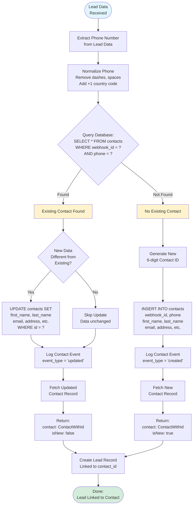
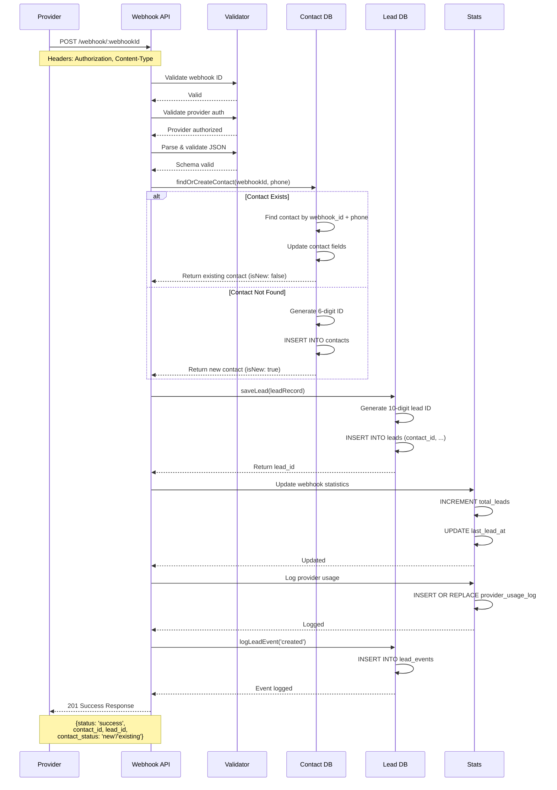
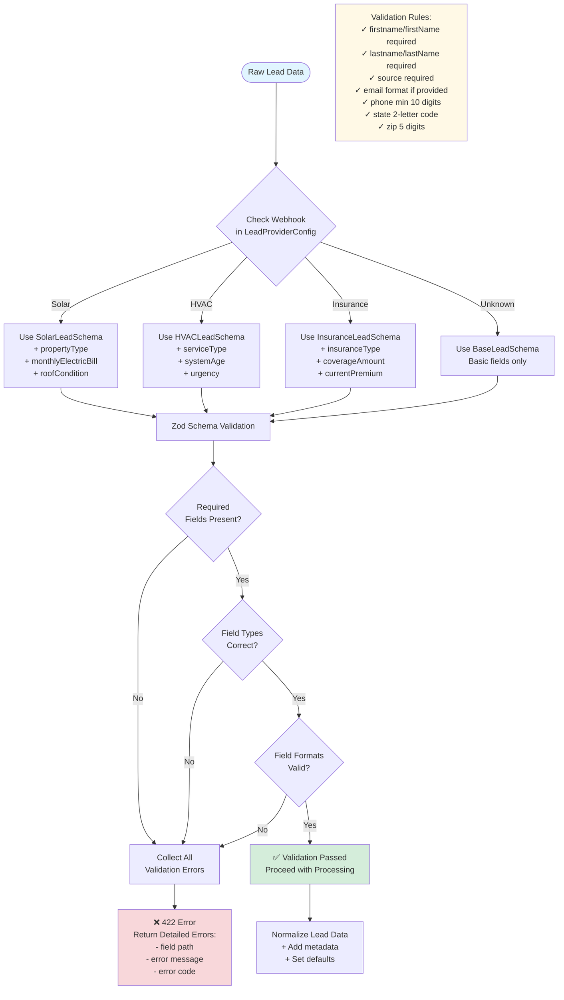
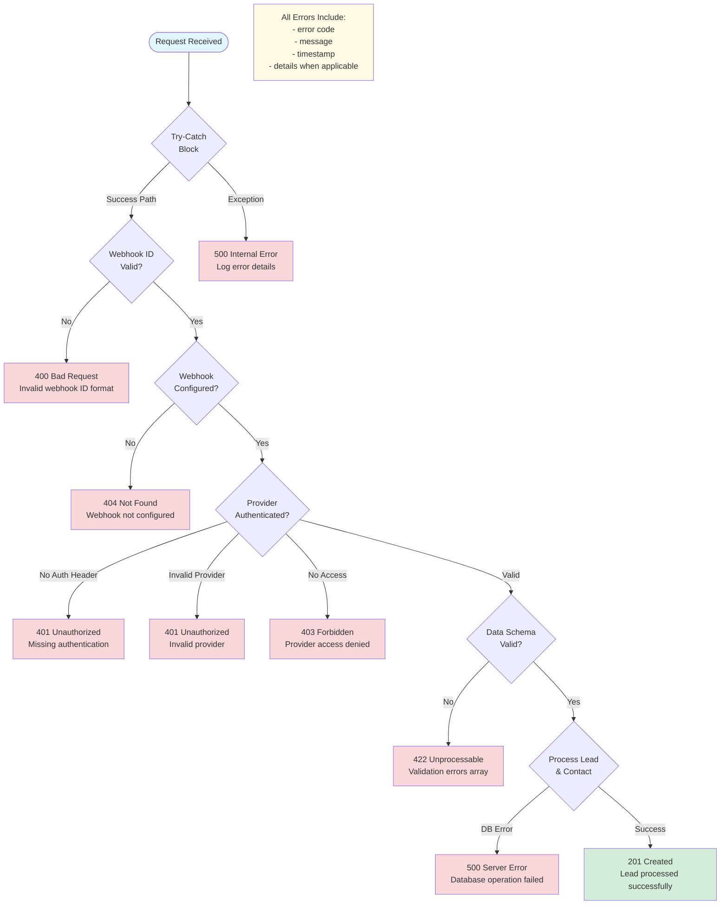
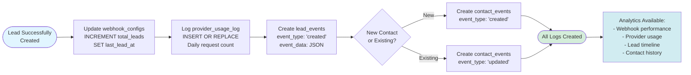

# Webhook Lead Receiving Flow Diagram

## Complete Lead Processing Flow

```mermaid
flowchart TD
    Start([Third-Party Provider<br/>Sends Lead]) --> ValidateWebhookID{Validate<br/>Webhook ID<br/>Format?}
    
    ValidateWebhookID -->|Invalid| Error400_1[❌ 400 Error<br/>Invalid webhook ID format]
    ValidateWebhookID -->|Valid| CheckWebhookDB{Webhook<br/>Exists in DB<br/>& Active?}
    
    CheckWebhookDB -->|No| Error404[❌ 404 Error<br/>Webhook not configured]
    CheckWebhookDB -->|Yes| ValidateProvider{Provider<br/>Authentication<br/>Header?}
    
    ValidateProvider -->|Missing| Error401_1[❌ 401 Error<br/>Missing provider authentication]
    ValidateProvider -->|Present| CheckProviderDB{Provider<br/>in DB &<br/>Active?}
    
    CheckProviderDB -->|No| Error401_2[❌ 401 Error<br/>Invalid provider]
    CheckProviderDB -->|Yes| CheckProviderAccess{Provider<br/>Allowed for<br/>Webhook?}
    
    CheckProviderAccess -->|No| Error403[❌ 403 Error<br/>Provider access denied]
    CheckProviderAccess -->|Yes| UpdateProviderUsage[Update Provider<br/>last_used_at]
    
    UpdateProviderUsage --> ValidateContentType{Content-Type<br/>= JSON?}
    
    ValidateContentType -->|No| Error400_2[❌ 400 Error<br/>Invalid content type]
    ValidateContentType -->|Yes| ParseJSON{Parse JSON<br/>Body}
    
    ParseJSON -->|Failed| Error400_3[❌ 400 Error<br/>Invalid JSON]
    ParseJSON -->|Success| CheckSignature{Webhook<br/>Secret<br/>Configured?}
    
    CheckSignature -->|Yes| ValidateSignature{Validate<br/>HMAC-SHA256<br/>Signature}
    CheckSignature -->|No| GetSchema[Get Lead Schema<br/>based on Webhook Type]
    
    ValidateSignature -->|Invalid| Error401_3[❌ 401 Error<br/>Invalid signature]
    ValidateSignature -->|Valid| GetSchema
    
    GetSchema --> ValidateSchema{Validate Lead<br/>Data Against<br/>Schema}
    
    ValidateSchema -->|Failed| Error422[❌ 422 Error<br/>Validation failed<br/>with details]
    ValidateSchema -->|Success| NormalizePhone[Normalize Phone Number<br/>to E.164 Format<br/>+1XXXXXXXXXX]
    
    NormalizePhone --> CheckPhoneValid{Phone<br/>Number<br/>Valid?}
    
    CheckPhoneValid -->|No| Error400_4[❌ 400 Error<br/>Invalid phone number]
    CheckPhoneValid -->|Yes| FindContact{Find Contact<br/>by webhook_id<br/>+ phone}
    
    FindContact -->|Not Found| CreateContact[Create New Contact<br/>Generate 6-digit ID]
    FindContact -->|Found| UpdateContact[Update Existing<br/>Contact Info]
    
    CreateContact --> ContactCreated[Contact Created<br/>isNew = true]
    UpdateContact --> ContactUpdated[Contact Updated<br/>isNew = false]
    
    ContactCreated --> GenerateLeadID[Generate Unique<br/>10-digit Lead ID]
    ContactUpdated --> GenerateLeadID
    
    GenerateLeadID --> InsertLead[Insert Lead Record<br/>- Link to contact_id<br/>- Store raw_payload<br/>- Set status = 'new']
    
    InsertLead --> UpdateWebhookStats[Update Webhook Stats<br/>- Increment total_leads<br/>- Update last_lead_at]
    
    UpdateWebhookStats --> LogProviderUsage[Log Provider Usage<br/>INSERT OR REPLACE<br/>provider_usage_log]
    
    LogProviderUsage --> LogLeadEvent[Log Lead Event<br/>event_type = 'created']
    
    LogLeadEvent --> Success{New Contact<br/>or Existing?}
    
    Success -->|New| SuccessNew[✅ 201 Success<br/>New contact created<br/>Lead processed]
    Success -->|Existing| SuccessExisting[✅ 201 Success<br/>Lead added to<br/>existing contact]
    
    style Start fill:#e1f5ff
    style SuccessNew fill:#d4edda
    style SuccessExisting fill:#d4edda
    style Error400_1 fill:#f8d7da
    style Error404 fill:#f8d7da
    style Error401_1 fill:#f8d7da
    style Error401_2 fill:#f8d7da
    style Error403 fill:#f8d7da
    style Error400_2 fill:#f8d7da
    style Error400_3 fill:#f8d7da
    style Error401_3 fill:#f8d7da
    style Error422 fill:#f8d7da
    style Error400_4 fill:#f8d7da
```



---

## Contact Deduplication Flow



---

## Database Transaction Flow



---

## Phone Number Normalization Flow

```mermaid
flowchart TD
    Start([Phone Input]) --> RemoveSpaces[Remove All Spaces<br/>Dashes, Parentheses]
    
    RemoveSpaces --> CheckLength{Length ≥ 10?}
    
    CheckLength -->|No| Invalid[❌ Invalid Phone<br/>Too Short]
    CheckLength -->|Yes| CheckFormat{Starts<br/>with +1?}
    
    CheckFormat -->|Yes| Already[Already Normalized<br/>+1XXXXXXXXXX]
    CheckFormat -->|No| CheckCountry{Starts<br/>with 1?}
    
    CheckCountry -->|Yes| AddPlus[Add + Prefix<br/>Result: +1XXXXXXXXXX]
    CheckCountry -->|No| AddBoth[Add +1 Prefix<br/>Result: +1XXXXXXXXXX]
    
    Already --> Validate{Valid US<br/>Phone Number?}
    AddPlus --> Validate
    AddBoth --> Validate
    
    Validate -->|No| Invalid
    Validate -->|Yes| Success[✅ Normalized<br/>+1XXXXXXXXXX]
    
    Success --> UseAsKey[Use as Unique Key<br/>for Contact Lookup]
    
    style Start fill:#e1f5ff
    style Success fill:#d4edda
    style Invalid fill:#f8d7da
    
    Note1[Examples:<br/>5551234567 → +15551234567<br/>555-123-4567 → +15551234567<br/>(555) 123-4567 → +15551234567<br/>+15551234567 → +15551234567]
    
    style Note1 fill:#fff9e6
```

---

## Lead Schema Validation Flow



---

## Error Handling & Response Flow



---

## Statistics & Logging Flow



---

## Key Concepts Summary

### 1. **Unique Contact per Webhook**
- One contact per unique `webhook_id` + `phone` combination
- Prevents duplicate contacts across multiple lead submissions
- Maintains relationship between leads and contacts

### 2. **Lead-to-Contact Relationship**
- **One-to-Many**: One contact can have many leads
- Each lead is linked via `contact_id` foreign key
- Tracks full history of interactions per contact

### 3. **Phone Normalization Strategy**
- All phones stored as `+1XXXXXXXXXX`
- Enables consistent matching across different formats
- Used as unique identifier within webhook scope

### 4. **Validation Layers**
1. **Webhook ID Format** - Pattern matching
2. **Provider Authentication** - Database lookup
3. **Provider Access** - Webhook restrictions
4. **Content Type** - JSON requirement
5. **JSON Parsing** - Valid JSON structure
6. **Schema Validation** - Zod runtime validation
7. **Phone Validation** - E.164 format

### 5. **Database Transaction Safety**
- Uses prepared statements with parameter binding
- Atomic operations where possible
- Error handling prevents partial writes
- Logging failures don't break main flow

### 6. **Soft Delete Protection**
- Webhooks can be soft-deleted with 24-hour grace period
- Deleted webhooks cannot receive new leads
- Restoration available before permanent deletion
- All lead data preserved regardless of webhook status

---

## Performance Considerations

### Database Indexes
```sql
-- Contacts table
CREATE UNIQUE INDEX idx_contacts_webhook_phone 
ON contacts(webhook_id, phone);

-- Leads table
CREATE INDEX idx_leads_webhook_id ON leads(webhook_id);
CREATE INDEX idx_leads_contact_id ON leads(contact_id);
CREATE INDEX idx_leads_status ON leads(status);
CREATE INDEX idx_leads_created_at ON leads(created_at);

-- Provider usage
CREATE UNIQUE INDEX idx_provider_usage 
ON provider_usage_log(provider_id, webhook_id, date);
```

### Query Optimization
- Single query for contact lookup: `O(1)` with index
- Batch updates for statistics: Grouped operations
- Fire-and-forget logging: Async where possible
- Connection pooling: D1 handles automatically

### Edge Computing Benefits
- Low latency: Runs closest to request origin
- Global distribution: Multiple data centers
- Auto-scaling: Handles traffic spikes
- No cold starts: Always-on edge functions

---

## Related Documentation

- [Complete API Documentation](/webhook-api/API_DOCUMENTATION.md)
- [Soft Delete System](/docs/webhook-soft-deletion/)
- [Deployment Guide](/WEBHOOK_SOFT_DELETE_DEPLOYMENT.md)
- [Implementation Study](/WEBHOOK_LEAD_RECEIVING_IMPLEMENTATION.md)

