# Convio Leads Database Schema Diagram

This mermaid diagram shows the complete database structure for the Convio Leads system, including all tables, relationships, and data flow.

```mermaid
erDiagram
    %% Main Entities
    LEADS {
        INTEGER id PK
        TEXT webhook_id
        TEXT lead_type
        TEXT first_name
        TEXT last_name
        TEXT email
        TEXT phone
        TEXT address
        TEXT city
        TEXT state
        TEXT zip_code
        TEXT source
        TEXT campaign_id
        TEXT utm_source
        TEXT utm_medium
        TEXT utm_campaign
        REAL monthly_electric_bill
        TEXT property_type
        TEXT roof_condition
        INTEGER roof_age
        TEXT shade_coverage
        TEXT system_type
        INTEGER system_age
        TEXT service_type
        TEXT urgency
        INTEGER property_size
        TEXT policy_type
        REAL coverage_amount
        REAL current_premium
        REAL property_value
        TEXT claims_history
        TEXT raw_payload
        TEXT ip_address
        TEXT user_agent
        DATETIME created_at
        DATETIME updated_at
        DATETIME processed_at
        TEXT status
        TEXT notes
        REAL conversion_score
        REAL revenue_potential
    }

    CONTACTS {
        INTEGER id PK
        TEXT webhook_id
        TEXT phone
        TEXT first_name
        TEXT last_name
        TEXT email
        TEXT address
        TEXT city
        TEXT state
        TEXT zip_code
        DATETIME created_at
        DATETIME updated_at
    }

    WEBHOOK_CONFIGS {
        INTEGER id PK
        TEXT webhook_id UK
        TEXT name
        TEXT description
        TEXT lead_type
        BOOLEAN is_active
        TEXT secret_key
        INTEGER rate_limit
        INTEGER rate_window
        INTEGER total_leads
        DATETIME last_lead_at
        DATETIME created_at
        DATETIME updated_at
    }

    WORKSPACES {
        TEXT id PK
        TEXT name
        TEXT api_key UK
        TEXT permissions
        BOOLEAN is_active
        DATETIME created_at
        DATETIME updated_at
        DATETIME last_activity_at
        INTEGER total_conversions
        REAL total_revenue
        TEXT metadata
    }

    %% Conversion and Tracking
    CONVERSIONS {
        TEXT id PK
        INTEGER contact_id
        INTEGER lead_id
        TEXT workspace_id
        TEXT converted_by
        DATETIME converted_at
        TEXT conversion_type
        REAL conversion_value
        TEXT currency
        TEXT custom_data
        DATETIME created_at
        DATETIME updated_at
    }

    WORKSPACE_TRACKING {
        INTEGER id PK
        INTEGER contact_id
        INTEGER lead_id
        TEXT workspace_id
        TEXT action
        TEXT action_details
        TEXT performed_by
        TEXT metadata
        DATETIME timestamp
    }

    %% Appointments
    APPOINTMENTS {
        INTEGER id PK
        INTEGER lead_id
        INTEGER contact_id
        TEXT appointment_type
        DATETIME scheduled_at
        INTEGER duration_minutes
        TEXT status
        TEXT location_type
        TEXT location_address
        TEXT notes
        TEXT customer_notes
        TEXT assigned_to
        TEXT outcome
        TEXT next_action
        DATETIME next_action_date
        TEXT created_by
        DATETIME created_at
        DATETIME updated_at
    }

    APPOINTMENT_ROUTING_RULES {
        INTEGER id PK
        TEXT workspace_id
        TEXT product_types
        TEXT zip_codes
        INTEGER priority
        BOOLEAN is_active
        DATETIME created_at
        DATETIME updated_at
        TEXT created_by
        TEXT notes
    }

    %% Events and History
    LEAD_EVENTS {
        INTEGER id PK
        INTEGER lead_id
        TEXT event_type
        TEXT event_data
        DATETIME created_at
    }

    APPOINTMENT_EVENTS {
        INTEGER id PK
        INTEGER appointment_id
        TEXT event_type
        TEXT event_description
        TEXT old_value
        TEXT new_value
        TEXT performed_by
        TEXT metadata
        DATETIME created_at
    }

    CONVERSION_EVENTS {
        INTEGER id PK
        TEXT conversion_id
        TEXT event_type
        TEXT event_data
        TEXT created_by
        DATETIME created_at
    }

    %% Analytics
    LEAD_ANALYTICS {
        INTEGER id PK
        TEXT webhook_id
        DATE date
        INTEGER total_leads
        INTEGER converted_leads
        REAL conversion_rate
        REAL total_revenue
        REAL avg_time_to_conversion
        DATETIME created_at
        DATETIME updated_at
    }

    CONVERSION_ANALYTICS_CACHE {
        INTEGER id PK
        TEXT cache_key UK
        TEXT cache_data
        DATETIME expires_at
        DATETIME created_at
    }

    %% Providers
    LEAD_SOURCE_PROVIDERS {
        INTEGER id PK
        TEXT provider_id UK
        TEXT provider_name
        TEXT company_name
        TEXT contact_email
        TEXT api_key
        BOOLEAN is_active
        TEXT allowed_webhooks
        INTEGER rate_limit
        TEXT notes
        DATETIME created_at
        DATETIME updated_at
        DATETIME last_used_at
    }

    PROVIDER_USAGE_LOG {
        INTEGER id PK
        TEXT provider_id
        TEXT webhook_id
        INTEGER request_count
        DATE date
        DATETIME created_at
    }

    %% Relationships
    CONTACTS ||--o{ LEADS : has
    CONTACTS ||--o{ APPOINTMENTS : has
    CONTACTS ||--o{ CONVERSIONS : has
    CONTACTS ||--o{ WORKSPACE_TRACKING : tracked_in
    CONTACTS }o--|| WEBHOOK_CONFIGS : belongs_to

    LEADS ||--o{ LEAD_EVENTS : has
    LEADS ||--o{ APPOINTMENTS : has
    LEADS ||--o{ CONVERSIONS : has
    LEADS }o--|| WEBHOOK_CONFIGS : belongs_to
    LEADS }o--|| WORKSPACES : assigned_to

    WEBHOOK_CONFIGS ||--o{ LEAD_ANALYTICS : has

    WORKSPACES ||--o{ CONVERSIONS : has
    WORKSPACES ||--o{ WORKSPACE_TRACKING : has
    WORKSPACES ||--o{ APPOINTMENT_ROUTING_RULES : has

    CONVERSIONS ||--o{ CONVERSION_EVENTS : has

    APPOINTMENTS ||--o{ APPOINTMENT_EVENTS : has

    LEAD_SOURCE_PROVIDERS ||--o{ PROVIDER_USAGE_LOG : has

    %% Views (for reference)
    APPOINTMENT_SUMMARY_VIEW {
        INTEGER appointment_id
        TEXT appointment_type
        DATETIME scheduled_at
        TEXT status
        INTEGER lead_id
        TEXT lead_type
        TEXT source
        INTEGER contact_id
        TEXT contact_phone
        TEXT contact_first_name
        TEXT contact_last_name
        TEXT webhook_name
        TEXT webhook_type
    }

    WORKSPACE_CONVERSION_SUMMARY {
        TEXT workspace_id
        TEXT workspace_name
        INTEGER total_conversions
        REAL total_revenue
        REAL avg_conversion_value
        INTEGER unique_contacts_converted
        DATETIME last_conversion_date
    }

    CONVERSION_FUNNEL {
        INTEGER total_leads
        INTEGER contacted_leads
        INTEGER qualified_leads
        INTEGER converted_leads
        REAL conversion_rate
    }

    DAILY_CONVERSION_METRICS {
        DATE conversion_date
        INTEGER conversion_count
        REAL daily_revenue
        REAL avg_value
        INTEGER active_workspaces
        INTEGER active_agents
    }
```



## Database Schema Overview

### Core Tables

**CONTACTS**: Primary customer entities storing normalized information:
- Personal details (name, email, phone, address) with custom 6-digit IDs
- Normalized phone numbers (+1XXXXXXXXXX format)
- Unique constraint per webhook/phone combination
- Central entity that can have multiple leads

**LEADS**: Campaign-specific lead records linked to contacts:
- Industry-specific fields (solar, HVAC, insurance)
- Lead source tracking (UTM parameters, campaign info)
- Status and metadata for specific campaigns/interests
- Multiple leads can belong to the same contact

## Simple ASCII Flow Diagram

```
┌─────────────┐    ┌─────────────┐    ┌─────────────┐
│   CONTACTS  │    │    LEADS    │    │APPOINTMENTS │
│  (People)   │◄──►│(Campaigns)  │◄──►│(Meetings)   │
│             │    │             │    │             │
│ • John Doe  │    │ • Solar     │    │ • Solar     │
│ • +15551234 │    │ • HVAC      │    │   Consult   │
│ • 6-digit ID│    │ • Insurance │    │ • HVAC      │
│             │    │             │    │   Estimate  │
└─────────────┘    └─────────────┘    └─────────────┘
       │                   │                   │
       └───────────────────┼───────────────────┘
                           │
                    ┌─────────────┐
                    │CONVERSIONS  │
                    │   (Sales)   │
                    │ • Solar $5K │
                    │ • HVAC $3K  │
                    └─────────────┘
```

**Key Insight**: One contact can have multiple leads, and each lead can have multiple appointments, showing the complete customer journey across different products and services.

**WEBHOOK_CONFIGS**: Manages webhook endpoints:
- Rate limiting configuration
- Lead type specialization
- Statistics tracking

**WORKSPACES**: Multi-tenant workspace management:
- API key authentication
- Conversion tracking
- Workspace-specific permissions

### Conversion System

**CONVERSIONS**: Tracks conversion events:
- Links to both contacts and leads
- Supports multiple conversion types (sale, appointment, qualified, etc.)
- Revenue and custom data tracking

**WORKSPACE_TRACKING**: Audit trail for all workspace activities:
- Tracks all actions performed on contacts/leads
- Maintains detailed history

### Appointment Management

**APPOINTMENTS**: Appointment scheduling and management:
- Links to both leads and contacts
- Comprehensive status tracking
- Location and assignment management

**APPOINTMENT_ROUTING_RULES**: Automated routing system:
- Product type and zip code based routing
- Priority-based assignment
- Workspace-specific rules

### Analytics and Reporting

**LEAD_ANALYTICS**: Pre-aggregated analytics data:
- Daily metrics by webhook
- Conversion rates and revenue tracking

**CONVERSION_ANALYTICS_CACHE**: Performance optimization:
- Cached analytics queries
- Automatic expiration

### Provider Management

**LEAD_SOURCE_PROVIDERS**: Authorized third-party providers:
- API key management
- Rate limiting per provider
- Webhook access control

**PROVIDER_USAGE_LOG**: Usage tracking and analytics:
- Request volume monitoring
- Provider performance metrics

### Event Tracking

**LEAD_EVENTS**: Lead lifecycle tracking:
- All status changes and updates
- Complete audit trail

**APPOINTMENT_EVENTS**: Appointment history:
- Creation, changes, and status updates
- User attribution

**CONVERSION_EVENTS**: Detailed conversion tracking:
- Step-by-step conversion process
- Custom event data

### Views for Analytics

**APPOINTMENT_SUMMARY_VIEW**: Combined appointment data with related lead and contact information

**WORKSPACE_CONVERSION_SUMMARY**: Workspace-level conversion metrics

**CONVERSION_FUNNEL**: Lead-to-conversion funnel analysis

**DAILY_CONVERSION_METRICS**: Daily conversion performance

## Key Relationships

1. **Contact-Centric Flow**: `contacts` → `leads` → `appointments` → `conversions`
2. **Workspace Assignment**: All entities link back to `workspaces`
3. **Event Tracking**: All major tables have corresponding event tables
4. **Provider Integration**: `lead_source_providers` → `provider_usage_log`
5. **Analytics**: Pre-aggregated data in `lead_analytics` and cached results in `conversion_analytics_cache`
6. **Multi-Lead Support**: One contact can have multiple leads (different campaigns/products)

## ASCII Database Relationship Diagram

```
┌─────────────────────────────────────────────────────────────────┐
│                    WORKSPACES (Multi-tenant)                     │
│  +────────────+  +────────────+  +────────────+  +────────────+  │
│  │Workspace A │  │Workspace B │  │Workspace C │  │Workspace D │  │
│  +────────────+  +────────────+  +────────────+  +────────────+  │
└─────────────────────────────────────────────────────────────────┘
         │           │           │           │
         │           │           │           │
    ┌────▼────┐ ┌────▼────┐ ┌────▼────┐ ┌────▼────┐
    │CONTACTS│ │CONTACTS│ │CONTACTS│ │CONTACTS│
    │(People)│ │(People)│ │(People)│ │(People)│
    └────┬────┘ └────┬────┘ └────┬────┘ └────┬────┘
         │           │           │           │
         │1:N        │1:N        │1:N        │1:N
         │           │           │           │
    ┌────▼───────────▼───────────▼───────────▼────┐
    │                 LEADS                      │
    │      (Campaign-specific records)           │
    │  +────────+  +────────+  +────────+         │
    │  │Solar   │  │HVAC    │  │Insurance│  ...    │
    │  │Lead    │  │Lead    │  │Lead    │         │
    │  +────────+  +────────+  +────────+         │
    └────┬──────────────────────────────────────┬────┘
         │1:N                                  │1:N
         │                                    │
    ┌────▼────────────┐                 ┌────▼────────────┐
    │  APPOINTMENTS   │                 │  APPOINTMENTS   │
    │ (Consultations) │                 │ (Consultations) │
    │ +────────────+  │                 │ +────────────+  │
    │ │Consultation│  │                 │ │Consultation│  │
    │ │Meeting     │  │                 │ │Meeting     │  │
    │ +────────────+  │                 │ +────────────+  │
    └────┬────────────┘                 └────┬────────────┘
         │N:1                               │N:1
         │                                 │
    ┌────▼────────────┐                 ┌────▼────────────┐
    │  CONVERSIONS    │                 │  CONVERSIONS    │
    │    (Sales)      │                 │    (Sales)      │
    │ +────────────+  │                 │ +────────────+  │
    │ │Solar Sale  │  │                 │ │HVAC Sale   │  │
    │ │$5000       │  │                 │ │$3000       │  │
    │ +────────────+  │                 │ +────────────+  │
    └──────────────┬─┘                 └──────────────┬─┘
                   │                                 │
            ┌──────▼──────┐                 ┌──────▼──────┐
            │CONVERSIONS  │                 │CONVERSIONS  │
            │  SUMMARY    │                 │  SUMMARY    │
            │Analytics    │                 │Analytics    │
            └─────────────┘                 └─────────────┘
```

**Legend:**
- **CONTACTS**: Primary entities (people) with normalized info
- **LEADS**: Campaign-specific interests linked to contacts
- **APPOINTMENTS**: Scheduled consultations (can span multiple leads)
- **CONVERSIONS**: Sales/revenue tracking
- **WORKSPACES**: Separate client environments
- **1:N**: One-to-many relationship
- **N:1**: Many-to-one relationship

## Data Flow

1. **Contact Ingestion**: Third-party providers send leads via webhooks
2. **Contact Creation**: Customer information is normalized and stored as contacts
3. **Lead Generation**: Campaign-specific leads are created and linked to contacts
4. **Workspace Assignment**: Contacts and their leads are assigned to appropriate workspaces
5. **Appointment Scheduling**: Appointments are created for contacts (spanning multiple leads)
6. **Conversion Tracking**: When contacts become customers, conversions are tracked with detailed metrics
7. **Analytics Processing**: Data is aggregated and cached for performance

This contact-centric schema supports a complete customer management system with multi-tenancy, conversion tracking, appointment management, and comprehensive analytics, where contacts are the primary entities that can have multiple campaign-specific leads.
