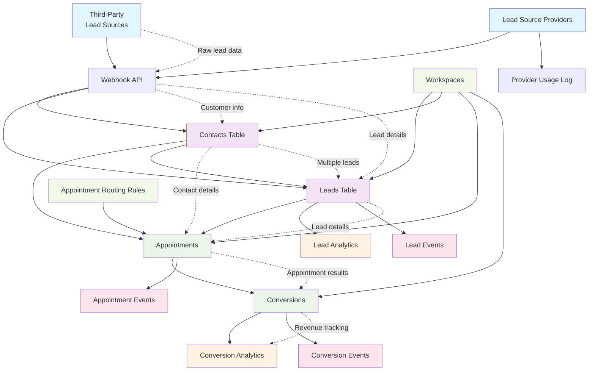

# Convio Leads Database - Simplified Diagram

This simplified version shows the core structure and main data flow for new team members.



## Key Concepts for New Interns

### 1. **Contact-Centric Flow** (The Main Journey)
```
Raw Lead → Contacts Table → Multiple Leads → Appointments → Conversions
```

**ASCII Relationship Diagram:**
```
                    CONTACTS (Primary - People)
                    +---------------------+
                    | ID: 123456          |
                    | Name: John Doe      |
                    | Phone: +15551234567 |
                    | Email: john@email.com|
                    +---------------------+
                               |
                               | 1:N (can have many)
                               |
                    +---------------------+
                    |      LEADS          |
                    +---------------------+
                    | Solar Campaign      |  ← Lead 1
                    | HVAC Campaign       |  ← Lead 2
                    | Insurance Campaign  |  ← Lead 3
                    +---------------------+
                               |
                               | 1:N (can have many)
                               |
                    +---------------------+
                    |   APPOINTMENTS      |
                    +---------------------+
                    | Solar Consultation  |  ← Appt 1
                    | HVAC Estimate       |  ← Appt 2
                    +---------------------+
                               |
                               | N:1 (lead to conversion)
                               |
                    +---------------------+
                    |   CONVERSIONS       |
                    +---------------------+
                    | Solar Sale - $5000  |  ← Conversion 1
                    +---------------------+
```

**Contacts Table**: Primary customer entities
- Contains normalized customer information (name, phone, email, address)
- Uses 6-digit custom IDs for unique identification
- One contact per unique phone number per webhook
- Can have multiple leads (different campaigns, products, etc.)

**Leads Table**: Campaign-specific lead records
- Each lead represents a specific customer interest/campaign
- Links back to the contact (the actual person)
- Contains campaign details, UTM parameters, industry-specific fields
- Multiple leads can belong to the same contact

**Appointments**: Customer consultations and meetings
- Links to both contacts and specific leads
- Tracks scheduling, status, location, assigned staff
- Records outcomes and next steps

**Conversions**: Successful sales and revenue
- Tracks when contacts become paying customers
- Links back to the originating contact and lead
- Records conversion value, type, and metadata

### 2. **Workspace System** (Multi-Tenant)
- Each client gets their own workspace
- Workspaces have separate API keys and permissions
- All leads, contacts, and conversions belong to a workspace
- Allows multiple clients to use the same system safely

### 3. **Event Tracking** (Audit Trail)
Every major table has an associated "events" table:
- **Lead Events**: Every time a lead status changes
- **Appointment Events**: Every appointment update
- **Conversion Events**: Every conversion step

This creates a complete history of everything that happens.

### 4. **Provider Management**
- **Lead Source Providers**: Companies that send leads via API
- Rate limiting and access control
- Usage tracking to monitor provider activity

### 5. **Analytics System**
- **Lead Analytics**: Daily statistics by webhook
- **Conversion Analytics**: Revenue and performance metrics
- Cached data for fast reporting

## Most Important Tables to Know

| Table | Purpose | Key Fields |
|-------|---------|------------|
| **contacts** | Primary customer entities | phone, first_name, last_name, email |
| **leads** | Campaign-specific lead records | source, lead_type, campaign_id, webhook_id |
| **appointments** | Scheduled meetings | scheduled_at, status, assigned_to |
| **conversions** | Successful sales | conversion_value, converted_at, type |
| **workspaces** | Client separation | name, api_key, permissions |

## Common Queries You'll Write

1. **Find all contacts created today:**
   ```sql
   SELECT * FROM contacts WHERE DATE(created_at) = DATE('now');
   ```

2. **Get appointments for next week:**
   ```sql
   SELECT * FROM appointments WHERE scheduled_at BETWEEN date('now') AND date('now', '+7 days');
   ```

3. **Find all leads for a specific contact:**
   ```sql
   SELECT l.* FROM leads l
   JOIN contacts c ON l.contact_id = c.id
   WHERE c.phone = '+15551234567';
   ```

4. **Find conversion rates by lead source:**
   ```sql
   SELECT source, COUNT(*) as leads, SUM(CASE WHEN conversion_id IS NOT NULL THEN 1 ELSE 0 END) as converted
   FROM leads GROUP BY source;
   ```

5. **Get workspace statistics:**
   ```sql
   SELECT name, total_conversions, total_revenue FROM workspaces;
   ```

6. **Find contacts with multiple leads:**
   ```sql
   SELECT c.phone, c.first_name, c.last_name, COUNT(l.id) as lead_count
   FROM contacts c
   JOIN leads l ON c.id = l.contact_id
   GROUP BY c.id, c.phone, c.first_name, c.last_name
   HAVING COUNT(l.id) > 1;
   ```

## Data Relationships

- **One contact** can have **many leads** (same person, different campaigns/products)
- **One lead** can have **many appointments** (multiple consultations for same campaign)
- **One contact** can have **many appointments** (across different leads)
- **One workspace** contains **many contacts, leads, appointments**
- **Every conversion** links back to a **contact** and **lead**
- **Every major action** creates an **event record** for audit trails

This contact-centric system tracks the complete customer journey from initial contact through multiple campaign interests to final conversion, with full audit trails and multi-tenant support.
