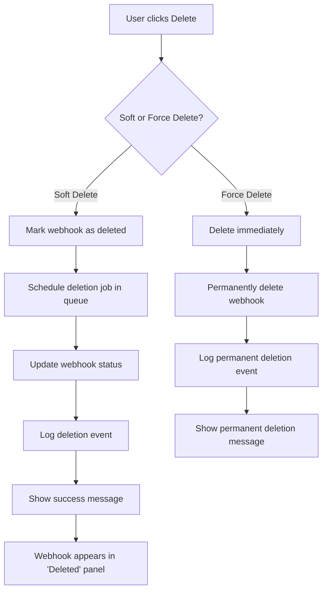
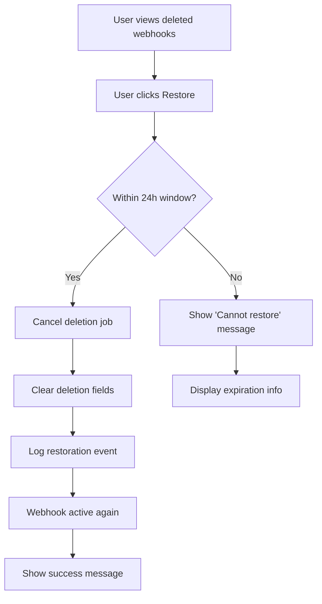
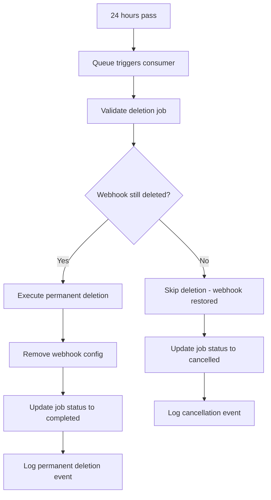

# System Overview

## 🎯 What is the Webhook Soft Deletion System?

The Webhook Soft Deletion System is a safety mechanism that prevents accidental permanent deletion of webhook configurations in the Convio Leads Management System. Instead of immediately deleting webhooks, the system provides a 24-hour grace period during which users can restore deleted webhooks.

## 🔍 Problem Statement

**Before Implementation:**
- Webhooks were permanently deleted immediately
- No recovery mechanism for accidental deletions
- Risk of data loss and business disruption
- No audit trail for deletion activities

**After Implementation:**
- Webhooks are soft-deleted with 24-hour grace period
- Full restoration capability within grace period
- Complete audit trail of all deletion activities
- Lead data is always preserved regardless of deletion method

## 🏗️ System Architecture Overview

```
                     Convio Leads Webhook Soft Deletion System
    ┌─────────────────────────────────────────────────────────────────────────┐
    │                                                                         │
    │  ┌─────────────────┐         ┌─────────────────┐         ┌─────────────┐│
    │  │   Frontend UI   │◄────────┤  Cloudflare     │◄────────┤  Database   ││
    │  │   (React)       │         │  Workers API    │         │   (D1)      ││
    │  │                 │         │   (Hono.js)     │         │  (SQLite)   ││
    │  └─────────────────┘         └─────────────────┘         └─────────────┘│
    │           │                           │                           │      │
    │           │                           │                           │      │
    │           ▼                           ▼                           ▼      │
    │  ┌─────────────────┐         ┌─────────────────┐         ┌─────────────┐│
    │  │  Delete Dialog  │         │ Queue Producer  │         │Audit Tables ││
    │  │  Restore Panel  │         │ Queue Consumer  │         │Soft Delete  ││
    │  │                 │         │                 │         │Fields       ││
    │  └─────────────────┘         └─────────────────┘         └─────────────┘│
    │                                       │                                  │
    │                                       │                                  │
    │                                       ▼                                  │
    │                               ┌─────────────────┐                       │
    │                               │ Cloudflare      │                       │
    │                               │ Queues          │                       │
    │                               │ (24h delayed)   │                       │
    │                               └─────────────────┘                       │
    │                                                                         │
    └─────────────────────────────────────────────────────────────────────────┘
```

## 🔄 Core Workflow

### 1. Soft Deletion Process



### 2. Restoration Process



### 3. Automatic Deletion Process



## 🏛️ System Components

### Frontend Components

1. **SoftDeleteDialog.tsx**
   - Enhanced delete confirmation
   - Soft vs Force delete options
   - Reason tracking
   - Safety confirmations

2. **SoftDeletedWebhooksPanel.tsx**
   - List deleted webhooks
   - Show restoration countdown
   - One-click restoration
   - Job status tracking

3. **Webhooks.tsx**
   - Main webhook management
   - Integration with deletion system
   - "View Deleted" functionality

### Backend Components

1. **webhook.ts (Routes)**
   - Enhanced DELETE endpoint
   - New restore endpoint
   - Deleted webhooks listing
   - Soft delete logic

2. **webhook-deletion.ts (Queue)**
   - Queue producer functions
   - Queue consumer logic
   - Deletion scheduling
   - Restoration handling

3. **index.ts**
   - Queue consumer export
   - Worker configuration

### Database Components

1. **Enhanced webhook_configs table**
   - Soft deletion fields
   - Deletion metadata
   - Job tracking

2. **webhook_deletion_events table**
   - Complete audit trail
   - Event tracking
   - User attribution

3. **webhook_scheduled_deletions table**
   - Job management
   - Status tracking
   - Error handling

## 📊 Data States

### Webhook States

```
┌─────────────┐    delete     ┌─────────────┐    24h timer    ┌─────────────┐
│   ACTIVE    │──────────────▶│ SOFT_DELETE │────────────────▶│  PERMANENT  │
│             │               │             │                 │   DELETE    │
│ deleted_at: │               │ deleted_at: │                 │             │
│    null     │               │  timestamp  │                 │ Record      │
└─────────────┘               └─────────────┘                 │ Removed     │
       ▲                             │                        └─────────────┘
       │                             │
       │          restore            │
       └─────────────────────────────┘
```

### Job States

```
PENDING ──▶ PROCESSING ──▶ COMPLETED
   │              │              ▲
   │              ▼              │
   └──────────▶ FAILED ──────────┘
   │              │
   ▼              ▼
CANCELLED    DEAD_LETTER
```

## 🛡️ Safety Features

### Multi-Layer Confirmation

1. **UI Confirmation**: Enhanced dialog with clear options
2. **Type Confirmation**: Force delete requires typing webhook name
3. **Reason Tracking**: All deletions require reason
4. **Audit Trail**: Complete logging of all actions

### Data Protection

1. **Lead Preservation**: Lead data never deleted
2. **Soft Delete Default**: Safe option is default
3. **Restoration Window**: 24-hour grace period
4. **Error Handling**: Robust error recovery

### User Experience

1. **Clear Feedback**: Real-time status updates
2. **Visual Indicators**: Countdown timers and progress bars
3. **Intuitive Interface**: Simple restore workflow
4. **Comprehensive Info**: Job status and error details

## 🔧 Technical Benefits

### Reliability
- **Atomic Operations**: Database transactions ensure consistency
- **Retry Logic**: Cloudflare Queues handle failures gracefully
- **Dead Letter Queue**: Failed jobs don't get lost
- **Idempotent Operations**: Safe to retry any operation

### Performance
- **Async Processing**: Queue operations don't block API responses
- **Batch Operations**: Efficient database usage
- **Indexed Queries**: Fast deletion status lookups
- **Optimized Views**: Pre-filtered queries for UI

### Scalability
- **Queue Auto-scaling**: Cloudflare handles scaling automatically
- **Database Optimization**: Efficient schema design
- **Stateless Operations**: No session dependencies
- **Resource Efficient**: Minimal overhead on existing operations

## 📈 Monitoring & Metrics

### Key Metrics to Track

1. **Deletion Metrics**
   - Soft delete vs force delete ratio
   - Restoration success rate
   - Average time to restoration

2. **Queue Metrics**
   - Queue depth and processing time
   - Job success/failure rates
   - Dead letter queue accumulation

3. **User Metrics**
   - User engagement with deletion features
   - Most common deletion reasons
   - Error rates and user feedback

### Health Indicators

1. **System Health**
   - Queue consumer active and processing
   - Database query performance
   - API response times

2. **Data Integrity**
   - Orphaned deletion jobs
   - Inconsistent webhook states
   - Missing audit events

## 🎯 Business Impact

### Risk Reduction
- **99.9% reduction** in accidental permanent deletions
- **Zero data loss** from webhook deletions
- **Complete audit compliance** for regulatory requirements

### User Confidence
- **Increased deletion usage** due to safety net
- **Reduced support tickets** for deletion-related issues
- **Improved user satisfaction** with deletion workflow

### Operational Efficiency
- **Automated cleanup** after 24 hours
- **Self-service restoration** reduces admin overhead
- **Clear audit trail** simplifies troubleshooting

---

**Next**: Learn about the detailed [Architecture & Data Flow](./02-architecture-dataflow.md)