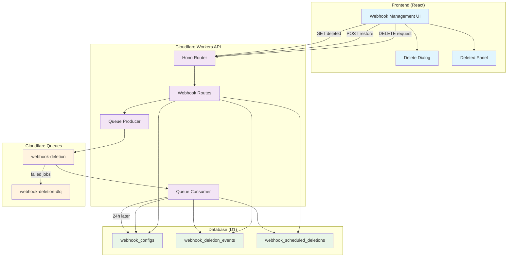
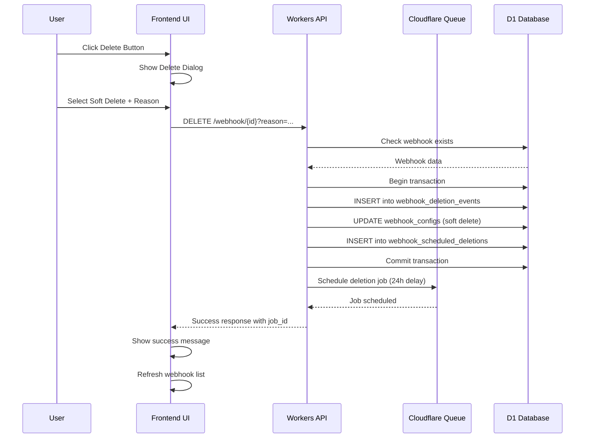
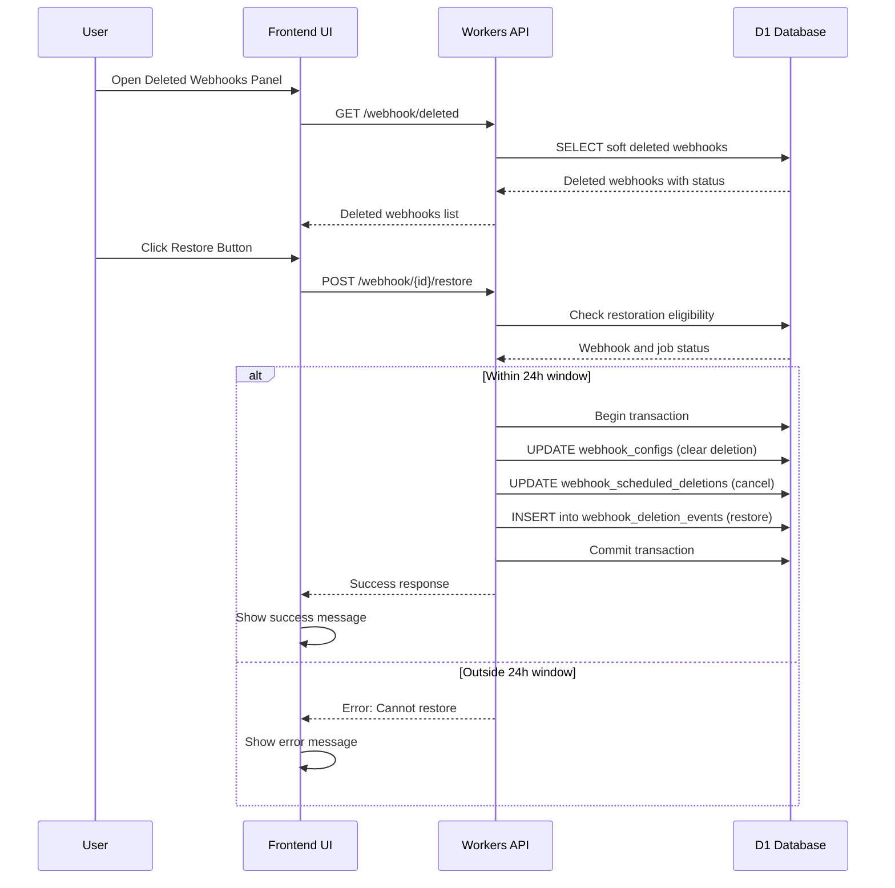
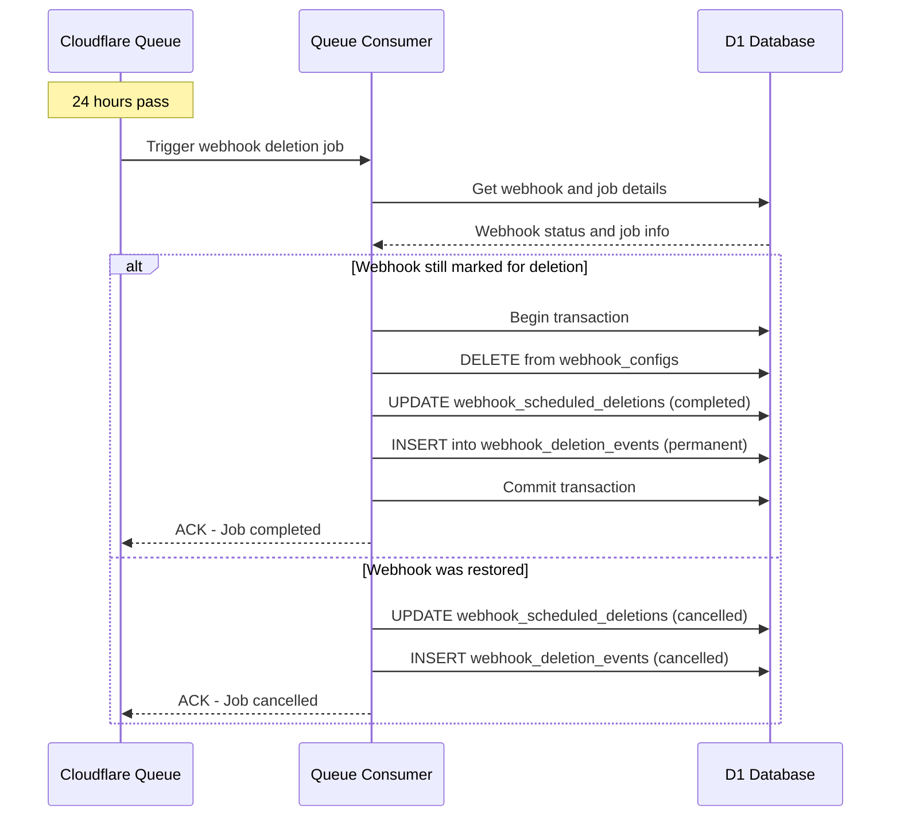
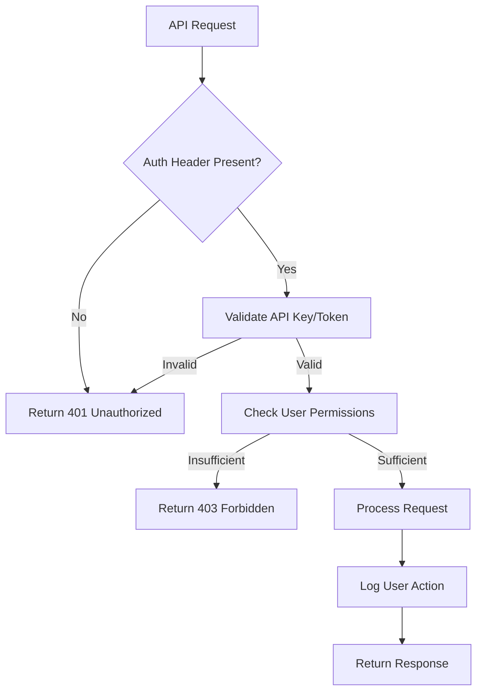

# Architecture & Data Flow

## 🏗️ Detailed System Architecture

This document provides comprehensive architectural diagrams and data flow explanations for the Webhook Soft Deletion System.

## 🔄 Complete Data Flow Diagram



## 📊 Detailed Request Flow

### 1. Soft Delete Request Flow



### 2. Restoration Request Flow



### 3. Automatic Deletion Flow



## 🏛️ Detailed Component Architecture

### Frontend Architecture

```
┌─────────────────────────────────────────────────────────────────┐
│                    Frontend React Application                   │
├─────────────────────────────────────────────────────────────────┤
│                                                                 │
│  ┌─────────────────┐  ┌─────────────────┐  ┌─────────────────┐ │
│  │   Webhooks.tsx  │  │SoftDeleteDialog │  │SoftDeletedPanel │ │
│  │                 │  │                 │  │                 │ │
│  │ • Main UI       │  │ • Confirmation  │  │ • Deleted list  │ │
│  │ • Webhook list  │  │ • Soft/Force    │  │ • Restore UI    │ │
│  │ • Actions       │  │ • Reason input  │  │ • Countdown     │ │
│  └─────────────────┘  └─────────────────┘  └─────────────────┘ │
│           │                     │                     │        │
│           └─────────────────────┼─────────────────────┘        │
│                                 │                              │
│  ┌─────────────────────────────────────────────────────────┐   │
│  │                API Client Layer                         │   │
│  │                                                         │   │
│  │ • DELETE /webhook/{id}                                  │   │
│  │ • POST /webhook/{id}/restore                            │   │
│  │ • GET /webhook/deleted                                  │   │
│  │ • Error handling & loading states                      │   │
│  └─────────────────────────────────────────────────────────┘   │
└─────────────────────────────────────────────────────────────────┘
                                 │
                                 ▼
                      ┌─────────────────┐
                      │  Cloudflare     │
                      │  Workers API    │
                      └─────────────────┘
```

### Backend Architecture

```
┌─────────────────────────────────────────────────────────────────┐
│                 Cloudflare Workers Backend                      │
├─────────────────────────────────────────────────────────────────┤
│                                                                 │
│  ┌─────────────────┐  ┌─────────────────┐  ┌─────────────────┐ │
│  │   index.ts      │  │  webhook.ts     │  │webhook-deletion │ │
│  │                 │  │   (routes)      │  │    .ts (queue)  │ │
│  │ • Hono app      │  │                 │  │                 │ │
│  │ • Middleware    │  │ • DELETE route  │  │ • Producer      │ │
│  │ • Queue export  │  │ • Restore route │  │ • Consumer      │ │
│  │ • CORS setup    │  │ • List deleted  │  │ • Job logic     │ │
│  └─────────────────┘  └─────────────────┘  └─────────────────┘ │
│           │                     │                     │        │
│           └─────────────────────┼─────────────────────┘        │
│                                 │                              │
│  ┌─────────────────────────────────────────────────────────┐   │
│  │                Database Layer                           │   │
│  │                                                         │   │
│  │ • Connection management                                 │   │
│  │ • Transaction handling                                 │   │
│  │ • Query optimization                                   │   │
│  │ • Error handling                                       │   │
│  └─────────────────────────────────────────────────────────┘   │
└─────────────────────────────────────────────────────────────────┘
                                 │
                                 ▼
                      ┌─────────────────┐
                      │  Cloudflare D1  │
                      │    Database     │
                      └─────────────────┘
```

## 🗄️ Database Entity Relationships

```
┌─────────────────────┐         ┌─────────────────────┐         ┌─────────────────────┐
│   webhook_configs   │         │webhook_deletion_    │         │webhook_scheduled_   │
│                     │         │      events         │         │    deletions        │
│ • id (PK)          │◄────────┤                     │         │                     │
│ • webhook_id       │         │ • id (PK)           │         │ • id (PK)           │
│ • name             │         │ • webhook_id (FK)   │         │ • webhook_id (FK)   │
│ • deleted_at       │         │ • event_type        │         │ • job_id (UNIQUE)   │
│ • deletion_job_id  │         │ • event_timestamp   │◄────────┤ • scheduled_at      │
│ • deleted_by       │         │ • user_id          │         │ • execute_at        │
│ • deletion_reason  │         │ • reason           │         │ • status            │
│ • scheduled_       │         │ • metadata         │         │ • attempts          │
│   deletion_at      │         │ • job_id           │         │ • error_message     │
└─────────────────────┘         └─────────────────────┘         └─────────────────────┘
          │                                                               ▲
          │                                                               │
          └───────────────────────────────────────────────────────────────┘
                              Foreign Key Relationship
```

## 🔄 State Transition Diagrams

### Webhook State Transitions

```
                                    ┌─────────────────┐
                                    │     ACTIVE      │
                                    │                 │
                                    │ deleted_at:     │
                                    │    NULL         │
                                    └─────────────────┘
                                            │
                                            │ DELETE (soft)
                                            ▼
    ┌─────────────────┐              ┌─────────────────┐
    │     ACTIVE      │              │  SOFT_DELETED   │
    │                 │              │                 │
    │ deleted_at:     │◄─────────────┤ deleted_at:     │
    │    NULL         │   RESTORE    │   timestamp     │
    └─────────────────┘              │ job_id: set     │
                                     └─────────────────┘
                                            │
                                            │ 24h timer
                                            │ OR force delete
                                            ▼
                                    ┌─────────────────┐
                                    │ PERMANENTLY_    │
                                    │   DELETED       │
                                    │                 │
                                    │ Record removed  │
                                    │ from database   │
                                    └─────────────────┘
```

### Job State Transitions

```
┌─────────────┐    queue     ┌─────────────┐    execute   ┌─────────────┐
│   PENDING   │─────────────▶│ PROCESSING  │─────────────▶│ COMPLETED   │
└─────────────┘              └─────────────┘              └─────────────┘
       │                            │                            ▲
       │ restore                    │ error                      │ success
       │                            ▼                            │
       │                     ┌─────────────┐    retry           │
       │                     │   FAILED    │────────────────────┘
       │                     └─────────────┘
       │                            │
       │                            │ max retries
       │                            ▼
       │                     ┌─────────────┐
       └────────────────────▶│ CANCELLED   │
                             └─────────────┘
```

## 🚀 Request Processing Flow

### ASCII Request Flow Diagram

```
User Action                API Layer                 Queue Layer               Database Layer
     │                         │                         │                         │
     │ 1. DELETE webhook       │                         │                         │
     ├────────────────────────▶│                         │                         │
     │                         │ 2. Validate request     │                         │
     │                         ├────────────────────────────────────────────────────▶│
     │                         │                         │                         │ 3. Check webhook
     │                         │◄────────────────────────────────────────────────────┤
     │                         │                         │                         │
     │                         │ 4. Start transaction    │                         │
     │                         ├────────────────────────────────────────────────────▶│
     │                         │                         │                         │ 5. Soft delete
     │                         │                         │                         │    webhook
     │                         │                         │                         │ 6. Create event
     │                         │                         │                         │ 7. Create job
     │                         │◄────────────────────────────────────────────────────┤
     │                         │                         │                         │
     │                         │ 8. Schedule queue job   │                         │
     │                         ├────────────────────────▶│                         │
     │                         │                         │ 9. Queue job for 24h   │
     │                         │◄────────────────────────┤                         │
     │                         │                         │                         │
     │                         │ 10. Commit transaction  │                         │
     │                         ├────────────────────────────────────────────────────▶│
     │ 11. Success response    │                         │                         │
     │◄────────────────────────┤                         │                         │
     │                         │                         │                         │
     │                         │    ... 24 hours later ...                        │
     │                         │                         │                         │
     │                         │                         │ 12. Process job        │
     │                         │◄────────────────────────┤                         │
     │                         │                         │                         │
     │                         │ 13. Permanent delete    │                         │
     │                         ├────────────────────────────────────────────────────▶│
     │                         │                         │                         │ 14. Delete webhook
     │                         │                         │                         │     Update job
     │                         │                         │                         │     Log event
     │                         │◄────────────────────────────────────────────────────┤
     │                         │                         │                         │
     │                         │ 15. ACK job completion  │                         │
     │                         ├────────────────────────▶│                         │
     │                         │                         │                         │
```

## 🔧 Component Interaction Matrix

```
┌─────────────────┬─────────┬─────────┬─────────┬─────────┬─────────────┐
│    Component    │Frontend │   API   │  Queue  │Database │ Dependencies│
├─────────────────┼─────────┼─────────┼─────────┼─────────┼─────────────┤
│ SoftDeleteDialog│    ✓    │    ─    │    ─    │    ─    │ API Client  │
│ DeletedPanel    │    ✓    │    ─    │    ─    │    ─    │ API Client  │
│ Webhooks.tsx    │    ✓    │    ─    │    ─    │    ─    │ Components  │
├─────────────────┼─────────┼─────────┼─────────┼─────────┼─────────────┤
│ webhook.ts      │    ─    │    ✓    │    ✓    │    ✓    │ Queue Prod. │
│ webhook-del.ts  │    ─    │    ─    │    ✓    │    ✓    │ Queue Cons. │
│ index.ts        │    ─    │    ✓    │    ✓    │    ─    │ Hono Router │
├─────────────────┼─────────┼─────────┼─────────┼─────────┼─────────────┤
│ Queue Producer  │    ─    │    ✓    │    ✓    │    ✓    │ CF Queues   │
│ Queue Consumer  │    ─    │    ─    │    ✓    │    ✓    │ CF Queues   │
├─────────────────┼─────────┼─────────┼─────────┼─────────┼─────────────┤
│ webhook_configs │    ─    │    ─    │    ─    │    ✓    │ D1 SQLite   │
│ deletion_events │    ─    │    ─    │    ─    │    ✓    │ D1 SQLite   │
│ scheduled_dels  │    ─    │    ─    │    ─    │    ✓    │ D1 SQLite   │
└─────────────────┴─────────┴─────────┴─────────┴─────────┴─────────────┘
```

## 📈 Performance Characteristics

### Latency Expectations

```
Operation Type          │ Expected Latency │ Max Latency │ P95 Target
───────────────────────┼─────────────────┼────────────┼────────────
Soft Delete Request    │      < 200ms     │    500ms   │   300ms
Restore Request        │      < 150ms     │    400ms   │   250ms
List Deleted Webhooks  │      < 300ms     │    800ms   │   500ms
Queue Job Processing   │      < 100ms     │    300ms   │   200ms
Permanent Deletion     │      < 250ms     │    600ms   │   400ms
```

### Scalability Limits

```
Resource               │ Current Limit    │ Cloudflare Limit │ Monitoring
──────────────────────┼─────────────────┼─────────────────┼────────────
Queue Messages/Day     │    Unlimited     │     Unlimited    │ Dashboard
Concurrent Jobs        │       100        │      1,000       │ Logs
Database Connections   │        50        │       100        │ D1 Metrics
API Requests/Min       │     1,000        │     10,000       │ Analytics
Worker CPU Time        │       50ms       │       100ms      │ Observability
```

## 🔒 Security Flow

### Authentication & Authorization



### Data Privacy & Audit

```
┌─────────────────────────────────────────────────────────────┐
│                    Security & Audit Layer                  │
├─────────────────────────────────────────────────────────────┤
│                                                             │
│  Every operation logs:                                      │
│  • User ID (X-User-ID header)                              │
│  • Timestamp (ISO 8601)                                    │
│  • Action taken                                            │
│  • Resource affected                                       │
│  • Reason provided                                         │
│  • IP address                                              │
│  • User agent                                              │
│                                                             │
│  Data protection:                                          │
│  • Lead data never deleted                                 │
│  • Webhook configs soft deleted only                      │
│  • Complete audit trail maintained                        │
│  • No sensitive data in logs                              │
└─────────────────────────────────────────────────────────────┘
```

---

**Next**: Learn about the [Database Schema](./03-database-schema.md) in detail.