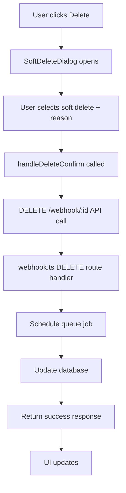

# Developer Onboarding Guide

## 👋 Welcome to the Webhook Soft Deletion System

This guide will help you get up to speed with the Webhook Soft Deletion System, whether you're a new intern or experienced developer joining the Convio Leads team.

## 🎯 Learning Objectives

By the end of this guide, you will:

1. **Understand** the business purpose and technical architecture
2. **Set up** your local development environment
3. **Navigate** the codebase confidently
4. **Debug** common issues independently
5. **Contribute** to the system effectively

## 📚 Learning Path

### Phase 1: Understanding (Days 1-2)
### Phase 2: Environment Setup (Day 3)
### Phase 3: Hands-on Exploration (Days 4-5)
### Phase 4: First Contribution (Week 2)

---

## 📖 Phase 1: Understanding (Days 1-2)

### Day 1 Morning: Business Context

#### Why Soft Deletion Exists

```
Business Problem:
┌─────────────────────────────────────────────────────────────────┐
│ "We accidentally deleted our main webhook and lost a day of     │
│  lead collection. Can we prevent this in the future?"          │
└─────────────────────────────────────────────────────────────────┘

Technical Solution:
┌─────────────────────────────────────────────────────────────────┐
│ Soft Deletion with 24-hour grace period:                       │
│ • Webhooks marked as "deleted" instead of removed              │
│ • 24-hour window for restoration                               │
│ • Cloudflare Queues for precise timing                         │
│ • Complete audit trail                                         │
│ • Lead data always preserved                                   │
└─────────────────────────────────────────────────────────────────┘
```

#### Read These Documents (2-3 hours)

1. **[System Overview](./01-system-overview.md)** (45 minutes)
   - Focus on the "Problem Statement" and "Core Workflow" sections
   - Understand the business impact

2. **[Architecture & Data Flow](./02-architecture-dataflow.md)** (60 minutes)
   - Study the Mermaid diagrams
   - Understand component interactions

3. **[Database Schema](./03-database-schema.md)** (45 minutes)
   - Focus on table relationships
   - Understand the state transitions

#### Self-Assessment Questions

After reading, you should be able to answer:

```
1. What happens when a user clicks "Delete" on a webhook?
2. How long does a user have to restore a deleted webhook?
3. What data is preserved when a webhook is deleted?
4. What technologies are used for scheduling the 24-hour delay?
5. How many database tables are involved in soft deletion?
```

**Answers:**
1. Webhook is marked for deletion and scheduled for permanent removal in 24 hours
2. 24 hours from the time of deletion
3. All lead data is preserved; only webhook configuration is affected
4. Cloudflare Queues with delayed message processing
5. Three main tables: webhook_configs (enhanced), webhook_deletion_events, webhook_scheduled_deletions

### Day 1 Afternoon: Code Exploration

#### Codebase Tour (2 hours)

Follow this exploration path:

```
Codebase Navigation Path:
┌─────────────────────────────────────────────────────────────────┐
│ 1. Start with the main documentation                            │
│    📁 docs/webhook-soft-deletion/README.md                     │
│                                                                 │
│ 2. Examine the database migration                              │
│    📁 webhook-api/webhook-api/migrations/                      │
│    📄 add-webhook-soft-deletion.sql                            │
│                                                                 │
│ 3. Study the backend implementation                            │
│    📁 webhook-api/webhook-api/src/                             │
│    📄 routes/webhook.ts (enhanced DELETE endpoint)             │
│    📄 queue/webhook-deletion.ts (queue logic)                  │
│    📄 index.ts (queue consumer export)                         │
│                                                                 │
│ 4. Explore the frontend components                             │
│    📁 src/components/webhooks/                                 │
│    📄 SoftDeleteDialog.tsx                                     │
│    📄 SoftDeletedWebhooksPanel.tsx                             │
│    📄 ../../pages/Webhooks.tsx (main integration)             │
│                                                                 │
│ 5. Check configuration files                                   │
│    📄 webhook-api/webhook-api/wrangler.jsonc (queue config)    │
└─────────────────────────────────────────────────────────────────┘
```

#### Code Reading Checklist

For each file, identify:

- [ ] **Purpose**: What does this file do?
- [ ] **Inputs**: What data does it receive?
- [ ] **Outputs**: What does it produce?
- [ ] **Dependencies**: What other files/services does it use?
- [ ] **Error Handling**: How are errors managed?

#### Practical Exercise: Trace a Request

Pick one scenario and trace it through the code:

**Scenario: User soft-deletes a webhook**



**Your Task:** Find the exact code locations for steps D, F, G, and H.

### Day 2: Deep Dive

#### Morning: Database Deep Dive (2 hours)

1. **Set up database access** (if available)
   ```bash
   # Connect to development database
   cd webhook-api/webhook-api
   wrangler d1 execute convio-leads --command "SELECT COUNT(*) FROM webhook_configs;"
   ```

2. **Study the schema**
   ```sql
   -- Understand table relationships
   PRAGMA table_info(webhook_configs);
   PRAGMA table_info(webhook_deletion_events);
   PRAGMA table_info(webhook_scheduled_deletions);

   -- Explore sample data
   SELECT * FROM webhook_configs LIMIT 5;
   SELECT * FROM webhook_deletion_events LIMIT 5;
   ```

3. **Practice queries**
   ```sql
   -- Find soft-deleted webhooks
   SELECT webhook_id, name, deleted_at, deletion_reason
   FROM webhook_configs
   WHERE deleted_at IS NOT NULL;

   -- Get deletion history for a webhook
   SELECT event_type, event_timestamp, reason
   FROM webhook_deletion_events
   WHERE webhook_id = (SELECT id FROM webhook_configs WHERE webhook_id = 'some-webhook-id')
   ORDER BY event_timestamp;
   ```

#### Afternoon: API Deep Dive (2 hours)

1. **Study API endpoints**
   - Read [API Documentation](./04-api-documentation.md)
   - Understand request/response formats
   - Learn error codes and handling

2. **Test API calls** (if dev environment available)
   ```bash
   # List active webhooks
   curl -X GET "https://dev-api.homeprojectpartners.com/webhook"

   # List deleted webhooks
   curl -X GET "https://dev-api.homeprojectpartners.com/webhook/deleted"

   # Test soft delete (on test webhook)
   curl -X DELETE "https://dev-api.homeprojectpartners.com/webhook/test-webhook-123?reason=Learning" \
     -H "X-User-ID: intern-user"
   ```

3. **API Integration Practice**
   Write a simple script to interact with the API:
   ```javascript
   // api-test.js
   async function testSoftDeletion() {
     // Create test webhook
     // Soft delete it
     // Check it appears in deleted list
     // Restore it
     // Verify it's back in active list
   }
   ```

---

## 🛠️ Phase 2: Environment Setup (Day 3)

### Prerequisites

Ensure you have:
- [ ] Node.js 18+ installed
- [ ] Git access to the repository
- [ ] Cloudflare account (for Workers development)
- [ ] Code editor (VS Code recommended)

### Frontend Setup

```bash
# 1. Clone the repository
git clone <repository-url>
cd convio-leads

# 2. Install dependencies
npm install

# 3. Start development server
npm run dev

# 4. Open in browser
# Typically http://localhost:8082
```

### Backend Setup

```bash
# 1. Navigate to API directory
cd webhook-api/webhook-api

# 2. Install dependencies
npm install

# 3. Install Cloudflare CLI
npm install -g wrangler

# 4. Authenticate with Cloudflare
wrangler auth login

# 5. Copy environment config
cp wrangler.example.toml wrangler.toml
# Edit with your account details

# 6. Start local development
npm run dev
# or
wrangler dev
```

### Development Environment Verification

#### Test Frontend
1. Navigate to webhooks page
2. Verify components load correctly
3. Check browser console for errors

#### Test Backend
```bash
# Health check
curl http://localhost:8787/health

# List webhooks
curl http://localhost:8787/webhook

# Check if API responds correctly
```

#### Test Database Connection
```bash
# List databases
wrangler d1 list

# Test query
wrangler d1 execute convio-leads --command "SELECT COUNT(*) FROM webhook_configs;"
```

### IDE Configuration

#### VS Code Extensions
Install these recommended extensions:
- TypeScript and JavaScript Language Features
- Tailwind CSS IntelliSense
- Prettier - Code formatter
- GitLens
- Thunder Client (for API testing)

#### Settings
```json
// .vscode/settings.json
{
  "typescript.preferences.inlineHints.enabled": true,
  "editor.formatOnSave": true,
  "editor.codeActionsOnSave": {
    "source.fixAll.eslint": true
  }
}
```

---

## 🔍 Phase 3: Hands-on Exploration (Days 4-5)

### Day 4: Frontend Exploration

#### Morning: Component Analysis

1. **SoftDeleteDialog Component**
   ```typescript
   // Study this component - locate it in your IDE
   // src/components/webhooks/SoftDeleteDialog.tsx

   // Questions to explore:
   // - How does it handle soft vs force delete?
   // - Where is form validation logic?
   // - How are confirmation requirements implemented?
   // - What props does it receive from parent?
   ```

2. **Practice: Modify the Dialog**
   ```typescript
   // Try making these changes (on a branch):
   // 1. Add a new field for "urgency level"
   // 2. Change the confirmation text
   // 3. Add a warning message for force delete
   // 4. Test your changes
   ```

#### Afternoon: State Management

1. **Webhooks.tsx Integration**
   ```typescript
   // Understand how state flows:
   // - How is webhook data fetched?
   // - How do delete/restore operations update UI?
   // - Where is loading state managed?
   // - How are errors handled and displayed?
   ```

2. **Practice: Add a Feature**
   ```typescript
   // Try adding a "Delete Multiple" feature:
   // 1. Add checkboxes to webhook cards
   // 2. Add a "Delete Selected" button
   // 3. Implement bulk deletion logic
   // (Don't commit - this is just practice!)
   ```

### Day 5: Backend Exploration

#### Morning: Queue System

1. **Understanding the Queue Consumer**
   ```typescript
   // Study webhook-deletion.ts
   // - How are jobs processed?
   // - What happens if a job fails?
   // - How is retry logic implemented?
   // - Where are jobs scheduled from?
   ```

2. **Practice: Debug the Queue**
   ```bash
   # Run these commands to understand queue state:
   wrangler queues list

   # Check for pending jobs
   wrangler d1 execute convio-leads --command "
   SELECT job_id, status, execute_at, attempts
   FROM webhook_scheduled_deletions
   WHERE status = 'pending';"

   # Monitor queue processing
   wrangler logs --tail
   ```

#### Afternoon: API Enhancement

1. **Add a New Endpoint**
   ```typescript
   // Practice by adding this endpoint to webhook.ts:
   // GET /webhook/:id/deletion-history
   // Should return all deletion events for a webhook

   webhook.get('/:webhookId/deletion-history', async (c) => {
     // Your implementation here
     // 1. Validate webhook ID
     // 2. Get webhook internal ID
     // 3. Query deletion events
     // 4. Return formatted response
   });
   ```

2. **Test Your Implementation**
   ```bash
   # Deploy locally and test
   npm run dev

   # Test the new endpoint
   curl http://localhost:8787/webhook/test-webhook-123/deletion-history
   ```

### Self-Assessment Exercises

#### Exercise 1: Request Flow Tracing
Map out the complete flow for webhook restoration:
1. User clicks "Restore" button
2. → Frontend component: ?
3. → API endpoint: ?
4. → Database operations: ?
5. → Queue operations: ?
6. → Response handling: ?

#### Exercise 2: Error Scenario Handling
What happens in these scenarios?
1. User tries to restore an expired webhook
2. Queue consumer fails to process a job 3 times
3. Database transaction fails during soft deletion
4. User tries to delete a webhook that doesn't exist

#### Exercise 3: Performance Analysis
Identify potential performance bottlenecks:
1. Database queries that could be slow
2. API endpoints that might timeout
3. Frontend operations that could cause lag
4. Queue processing limitations

---

## 🚀 Phase 4: First Contribution (Week 2)

### Choose Your First Task

Based on your interests and skill level:

#### Option 1: Frontend Enhancement (Beginner)
**Task:** Improve the deletion confirmation UX
- Add more intuitive icons
- Improve responsive design
- Add keyboard shortcuts
- Enhance accessibility

#### Option 2: API Improvement (Intermediate)
**Task:** Add deletion analytics endpoint
- Track deletion patterns
- Provide restoration statistics
- Add performance metrics
- Include usage insights

#### Option 3: Queue Optimization (Advanced)
**Task:** Improve queue error handling
- Better retry strategies
- Enhanced error reporting
- Dead letter queue processing
- Monitoring improvements

### Development Workflow

#### 1. Planning Phase
```bash
# Create feature branch
git checkout -b feature/your-improvement-name

# Document your plan
# Write a brief design document explaining:
# - What you're building
# - Why it's valuable
# - How you'll implement it
# - What you'll test
```

#### 2. Implementation Phase
```bash
# Follow TDD approach:
# 1. Write tests first (if applicable)
# 2. Implement minimum viable solution
# 3. Refactor and improve
# 4. Add error handling
# 5. Update documentation
```

#### 3. Testing Phase
```bash
# Frontend testing
npm run test  # If tests exist
npm run build  # Check for TypeScript errors

# Backend testing
cd webhook-api/webhook-api
npm run test
npm run validate

# Manual testing
# Test happy path
# Test error cases
# Test edge cases
```

#### 4. Code Review Preparation
```bash
# Clean up your commits
git rebase -i HEAD~3  # Squash/clean commits

# Self-review checklist:
# [ ] Code follows existing patterns
# [ ] Error handling is comprehensive
# [ ] Documentation is updated
# [ ] No console.log statements left
# [ ] TypeScript types are properly defined
# [ ] Performance impact considered
```

### Getting Feedback

#### Before Submitting PR
1. **Self-review**: Go through your changes critically
2. **Test thoroughly**: Happy path + edge cases
3. **Check documentation**: Update relevant docs
4. **Performance check**: Ensure no regression

#### During Code Review
1. **Respond promptly**: Address feedback quickly
2. **Ask questions**: Don't hesitate to clarify
3. **Learn actively**: Understand the "why" behind feedback
4. **Be open**: Consider alternative approaches

#### After PR Merge
1. **Monitor**: Watch for any issues in production
2. **Document**: Add learnings to personal notes
3. **Share**: Present your work to the team
4. **Plan next**: Identify next contribution opportunity

---

## 📚 Learning Resources

### Internal Resources

#### Documentation
- [System Overview](./01-system-overview.md) - Architecture and concepts
- [API Documentation](./04-api-documentation.md) - Complete API reference
- [Database Schema](./03-database-schema.md) - Data model details
- [Troubleshooting Guide](./07-troubleshooting.md) - Common issues and solutions

#### Code Examples
```bash
# Find usage examples in the codebase
grep -r "scheduleWebhookDeletion" webhook-api/
grep -r "SoftDeleteDialog" src/
grep -r "webhook_deletion_events" webhook-api/
```

### External Resources

#### Cloudflare Documentation
- [Cloudflare Queues](https://developers.cloudflare.com/queues/)
- [Cloudflare Workers](https://developers.cloudflare.com/workers/)
- [D1 Database](https://developers.cloudflare.com/d1/)

#### React/TypeScript
- [React TypeScript Cheatsheet](https://react-typescript-cheatsheet.netlify.app/)
- [TypeScript Handbook](https://www.typescriptlang.org/docs/)

#### Tools
- [Hono.js Documentation](https://hono.dev/) - Web framework
- [shadcn/ui](https://ui.shadcn.com/) - UI components
- [TailwindCSS](https://tailwindcss.com/) - Styling

---

## 🎯 Success Metrics

### Week 1 Goals
- [ ] Understand business purpose and technical architecture
- [ ] Successfully set up development environment
- [ ] Navigate codebase confidently
- [ ] Complete all self-assessment exercises
- [ ] Identify first contribution opportunity

### Week 2 Goals
- [ ] Complete first feature/improvement
- [ ] Submit well-reviewed pull request
- [ ] Demonstrate understanding through code review
- [ ] Update documentation for your changes
- [ ] Present work to team

### Month 1 Goals
- [ ] Independently debug and fix issues
- [ ] Contribute meaningfully to code reviews
- [ ] Propose improvements to the system
- [ ] Help onboard next new team member
- [ ] Take ownership of a system component

---

## 🤝 Getting Help

### Team Contacts

#### For Technical Questions
- **Senior Developer**: Complex implementation questions
- **Team Lead**: Architecture and design decisions
- **DevOps**: Infrastructure and deployment issues

#### For Business Questions
- **Product Manager**: Feature requirements and priorities
- **Stakeholders**: User experience and business impact

### Communication Channels

#### Daily Questions
- Team chat for quick questions
- Pair programming sessions
- Code review discussions

#### Escalation Path
1. **Try to solve independently** (15-30 minutes)
2. **Search documentation** and codebase
3. **Ask team member** for guidance
4. **Escalate to team lead** if needed

### Office Hours
- **Monday 2-3 PM**: Architecture discussions
- **Wednesday 10-11 AM**: Code review help
- **Friday 3-4 PM**: General Q&A and demos

---

## 📝 Knowledge Check

### Final Assessment

Before considering yourself fully onboarded, ensure you can:

#### Explain the System (5 minutes presentation)
- Business problem and solution
- Technical architecture overview
- Key components and their roles
- Data flow for main operations

#### Debug Common Issues (practical test)
- Queue jobs not processing
- Webhook in inconsistent state
- API returning errors
- Frontend components not updating

#### Implement Small Changes (coding exercise)
- Add new field to deletion dialog
- Create simple API endpoint
- Write database query
- Update frontend component

#### Code Review Participation (peer evaluation)
- Provide constructive feedback
- Ask relevant questions
- Suggest improvements
- Understand architectural implications

### Graduation Checklist

- [ ] **Understanding**: Can explain system purpose and architecture
- [ ] **Environment**: Development setup working perfectly
- [ ] **Navigation**: Confident moving through codebase
- [ ] **Debugging**: Can identify and fix common issues
- [ ] **Contribution**: Completed meaningful first contribution
- [ ] **Collaboration**: Actively participating in code reviews
- [ ] **Independence**: Working autonomously on assigned tasks
- [ ] **Knowledge Sharing**: Helping others learn the system

---

**Congratulations!** 🎉

You've successfully onboarded to the Webhook Soft Deletion System. You're now ready to be a productive member of the team and contribute to this critical business system.

Remember: Learning is continuous. Keep exploring, asking questions, and looking for opportunities to improve both the system and your skills.

**Welcome to the team!** 👥