# Home Project Partner Leads Database Schema Diagram

This document provides a comprehensive overview of the actual database structure for the Home Project Partner Leads system, including all tables, relationships, and business logic explanations for new team members.

## 🚀 QUICK START FOR NEW DEVELOPERS

### What This System Does
The Home Project Partner Leads Management System handles lead generation, contact management, appointment scheduling, and conversion tracking across multiple business verticals (Solar, HVAC, Insurance) with multi-tenant workspace support.

### Key Concepts
1. **Contact-Centric Design**: One contact (person) can have multiple leads (campaign interests)
2. **Phone Number Normalization**: All phones stored as `+1XXXXXXXXXX` for deduplication
3. **Multi-Tenant**: Each workspace is isolated with its own API keys and permissions
4. **Audit Trail**: Every major action is logged in event tables
5. **Provider Authentication**: Third-party lead sources are managed and rate-limited

## 🗄️ INTERACTIVE DATABASE SCHEMA

```mermaid
erDiagram
    %% ===== CORE ENTITIES =====
    CONTACTS {
        INTEGER id PK "Auto-increment primary key"
        TEXT webhook_id "Source webhook identifier"
        TEXT phone "Normalized phone +1XXXXXXXXXX"
        TEXT first_name "Required"
        TEXT last_name "Required"
        TEXT email "Primary contact email"
        TEXT address "Street address"
        TEXT address2 "Additional address info"
        TEXT city "City name"
        TEXT state "State code"
        TEXT zip_code "ZIP/postal code"
        TEXT sent_from_workspace "Originating workspace"
        TEXT converted_from_workspace "Converting workspace"
        TEXT conversion_status "pending, converted, rejected"
        DATETIME converted_timestamp "Conversion time"
        TEXT converted_by "Converting user"
        TEXT custom_metadata "JSON metadata"
        REAL lifetime_value "Customer LTV"
        INTEGER conversion_count "Total conversions"
        TEXT last_conversion_id "Latest conversion"
        REAL qualification_score "Lead qualification"
        DATETIME created_at "Record creation"
        DATETIME updated_at "Last update"
    }

    LEADS {
        INTEGER id PK "Custom IDs allowed"
        INTEGER contact_id FK "Links to contacts table"
        TEXT webhook_id "Source webhook identifier"
        TEXT lead_type "solar, hvac, insurance"
        TEXT first_name "Required"
        TEXT last_name "Required"
        TEXT email "Required"
        TEXT phone "Normalized format"
        TEXT address "Street address"
        TEXT address2 "Additional address info"
        TEXT city "City name"
        TEXT state "State code"
        TEXT zip_code "ZIP/postal code"
        TEXT source "Lead source identifier"
        TEXT campaign_id "Campaign tracking"
        TEXT utm_source "UTM tracking"
        TEXT utm_medium "UTM tracking"
        TEXT utm_campaign "UTM tracking"
        TEXT subsource "Additional source info"
        TEXT landing_page_url "Landing page URL"
        TEXT productid "Product identifier"
        REAL monthly_electric_bill "Solar specific"
        TEXT property_type "Property classification"
        TEXT roof_condition "Solar specific"
        INTEGER roof_age "Solar specific"
        TEXT shade_coverage "Solar specific"
        TEXT system_type "System classification"
        INTEGER system_age "Existing system age"
        TEXT service_type "Service required"
        TEXT urgency "Priority level"
        INTEGER property_size "Property size sq ft"
        TEXT policy_type "Insurance specific"
        REAL coverage_amount "Insurance amount"
        REAL current_premium "Insurance premium"
        REAL property_value "Property valuation"
        TEXT claims_history "Insurance history"
        TEXT consent_description "TCPA compliance"
        BOOLEAN consent_value "Consent given"
        BOOLEAN tcpa_compliance "TCPA compliant"
        TEXT raw_payload "Original webhook data"
        TEXT ip_address "Client IP"
        TEXT user_agent "Client browser"
        DATETIME created_at "Record creation"
        DATETIME updated_at "Last update"
        DATETIME processed_at "Processing timestamp"
        TEXT status "new, contacted, qualified"
        DATETIME status_changed_at "Status change time"
        TEXT status_changed_by "Who changed status"
        TEXT notes "Internal notes"
        INTEGER priority "Priority 1-5"
        TEXT assigned_to "Assigned user"
        DATETIME follow_up_date "Follow up date"
        INTEGER contact_attempts "Contact count"
        REAL conversion_score "Lead scoring"
        REAL revenue_potential "Revenue estimate"
        TEXT workspace_id "Assigned workspace"
        TEXT conversion_id "Linked conversion"
        TEXT conversion_metadata "Conversion data"
        DATETIME workspace_assigned_at "Assignment time"
        TEXT workspace_status "Workspace status"
    }

    WEBHOOK_CONFIGS {
        INTEGER id PK "Auto-increment primary key"
        TEXT webhook_id UK "Unique webhook identifier"
        TEXT name "Human-readable name"
        TEXT description "Webhook description"
        TEXT lead_type "solar, hvac, insurance"
        BOOLEAN is_active "Active status (default: 1)"
        TEXT secret_key "Optional webhook secret"
        INTEGER rate_limit "Requests per window (default: 100)"
        INTEGER rate_window "Rate limit window seconds (default: 60)"
        INTEGER total_leads "Total leads received (default: 0)"
        DATETIME last_lead_at "Last lead timestamp"
        DATETIME created_at "Record creation"
        DATETIME updated_at "Last update"
    }

    WORKSPACES {
        TEXT id PK "Workspace identifier string"
        TEXT name "Workspace display name"
        TEXT api_key UK "Unique API authentication key"
        TEXT permissions "JSON array of permissions"
        BOOLEAN is_active "Active status (default: TRUE)"
        TEXT outbound_webhook_url "Outbound webhook endpoint"
        BOOLEAN webhook_active "Webhook enabled (default: false)"
        DATETIME created_at "Record creation"
        DATETIME updated_at "Last update"
        DATETIME last_activity_at "Last activity timestamp"
        INTEGER total_conversions "Total conversions (default: 0)"
        REAL total_revenue "Total revenue (default: 0)"
        TEXT metadata "JSON workspace configuration"
    }

    %% ===== CONVERSION TRACKING =====
    CONVERSIONS {
        TEXT id PK "UUID format for unique identification"
        INTEGER contact_id FK "Links to contacts table"
        INTEGER lead_id FK "Links to leads table (optional)"
        TEXT workspace_id "Converting workspace"
        TEXT converted_by "User who converted"
        DATETIME converted_at "Conversion timestamp"
        TEXT conversion_type "sale, appointment, qualified, proposal, contract"
        REAL conversion_value "Revenue amount"
        TEXT currency "Currency code (default: USD)"
        TEXT custom_data "JSON field for dynamic data"
        DATETIME created_at "Record creation"
        DATETIME updated_at "Last update"
    }

    WORKSPACE_TRACKING {
        INTEGER id PK "Auto-increment primary key"
        INTEGER contact_id FK "Links to contacts table"
        INTEGER lead_id FK "Links to leads table (optional)"
        TEXT workspace_id "Target workspace"
        TEXT action "sent, received, converted, updated, qualified, rejected"
        TEXT action_details "Additional context"
        TEXT performed_by "User who performed action"
        TEXT metadata "JSON field for additional data"
        DATETIME timestamp "Action timestamp"
    }

    %% ===== APPOINTMENT MANAGEMENT =====
    APPOINTMENTS {
        INTEGER id PK "Auto-increment primary key"
        INTEGER lead_id FK "Links to leads table"
        INTEGER contact_id FK "Links to contacts table"
        TEXT appointment_type "consultation, estimate, installation, follow_up"
        DATETIME scheduled_at "Appointment date/time"
        INTEGER duration_minutes "Expected duration (default: 60)"
        TEXT status "scheduled, confirmed, completed, cancelled, no_show, rescheduled"
        TEXT location_type "home, office, phone, video (default: home)"
        TEXT location_address "Physical address for in-person"
        TEXT notes "Internal notes"
        TEXT customer_notes "Notes from customer"
        TEXT assigned_to "Sales rep or tech assigned"
        TEXT outcome "qualified, not_interested, needs_follow_up, proposal_sent"
        TEXT next_action "What needs to happen next"
        DATETIME next_action_date "When next action should happen"
        TEXT created_by "Who created the appointment"
        TEXT customer_name "Customer name override"
        TEXT customer_phone "Customer phone override"
        TEXT customer_email "Customer email override"
        TEXT service_type "Service type requested"
        TEXT customer_zip "Customer ZIP code"
        REAL estimated_value "Estimated appointment value"
        TEXT matched_workspace_id "Matched workspace for routing"
        TEXT routing_method "How appointment was routed"
        DATETIME forwarded_at "When forwarded to workspace"
        TEXT forward_status "pending, completed, failed"
        TEXT forward_response "Response from workspace"
        INTEGER forward_attempts "Number of forward attempts"
        TEXT raw_payload "Original appointment data"
        DATETIME created_at "Record creation"
        DATETIME updated_at "Last update"
    }

    APPOINTMENT_ROUTING_RULES {
        INTEGER id PK "Auto-increment primary key"
        TEXT workspace_id "Target workspace"
        TEXT product_types "JSON array: Kitchen, Bath, Solar"
        TEXT zip_codes "JSON array: ZIP codes served"
        INTEGER priority "Routing priority (default: 1)"
        BOOLEAN is_active "Active status (default: true)"
        TEXT created_by "Who created the rule"
        TEXT notes "Rule description"
        DATETIME created_at "Record creation"
        DATETIME updated_at "Last update"
    }

    %% ===== PROVIDER MANAGEMENT =====
    LEAD_SOURCE_PROVIDERS {
        INTEGER id PK "Auto-increment primary key"
        TEXT provider_id UK "Unique provider identifier"
        TEXT provider_name "Human-readable provider name"
        TEXT company_name "Company/organization name"
        TEXT contact_email "Contact email for provider"
        TEXT contact_name "Contact person name"
        TEXT contact_phone "Contact phone number"
        TEXT api_key "Optional API key for authentication"
        BOOLEAN is_active "Active status (default: 1)"
        TEXT allowed_webhooks "JSON array of webhook IDs (null = all)"
        INTEGER rate_limit "Requests per hour limit (default: 1000)"
        TEXT notes "Internal notes about provider"
        DATETIME created_at "Record creation"
        DATETIME updated_at "Last update"
        DATETIME last_used_at "Last successful request"
    }

    PROVIDER_USAGE_LOG {
        INTEGER id PK "Auto-increment primary key"
        TEXT provider_id FK "Links to lead_source_providers"
        TEXT webhook_id "Webhook identifier"
        INTEGER request_count "Requests made (default: 1)"
        DATE date "Usage date"
        DATETIME created_at "Record creation"
    }

    %% ===== EVENT TRACKING & AUDIT TRAIL =====
    LEAD_EVENTS {
        INTEGER id PK "Auto-increment primary key"
        INTEGER lead_id FK "Links to leads table"
        TEXT event_type "Event classification"
        TEXT event_data "JSON event details"
        DATETIME created_at "Event timestamp"
    }

    CONTACT_EVENTS {
        INTEGER id PK "Auto-increment primary key"
        INTEGER contact_id FK "Links to contacts table"
        TEXT event_type "created, updated, merged"
        TEXT event_data "JSON event details"
        DATETIME created_at "Event timestamp"
    }

    APPOINTMENT_EVENTS {
        INTEGER id PK "Auto-increment primary key"
        INTEGER appointment_id FK "Links to appointments table"
        TEXT event_type "created, confirmed, rescheduled, cancelled, completed"
        TEXT old_value "Previous value for changes"
        TEXT new_value "New value for changes"
        TEXT event_data "JSON data for complex events"
        TEXT created_by "Who made the change"
        TEXT metadata "Additional metadata"
        DATETIME created_at "Event timestamp"
    }

    CONVERSION_EVENTS {
        INTEGER id PK "Auto-increment primary key"
        TEXT conversion_id FK "Links to conversions table"
        TEXT event_type "status_change, value_update, note_added"
        TEXT event_data "JSON field with event details"
        TEXT created_by "User who created event"
        DATETIME created_at "Event timestamp"
    }

    LEAD_STATUS_HISTORY {
        INTEGER id PK "Auto-increment primary key"
        INTEGER lead_id FK "Links to leads table"
        TEXT old_status "Previous status"
        TEXT new_status "New status"
        TEXT changed_by "User ID or system identifier"
        TEXT changed_by_name "Display name of who made change"
        TEXT reason "Reason for status change"
        TEXT notes "Additional notes about change"
        TEXT metadata "JSON metadata about change"
        DATETIME created_at "Change timestamp"
    }

    LEAD_ACTIVITIES {
        INTEGER id PK "Auto-increment primary key"
        INTEGER lead_id FK "Links to leads table"
        TEXT activity_type "call, email, meeting, note, status_change"
        TEXT title "Activity title"
        TEXT description "Activity description"
        DATETIME activity_date "When activity occurred"
        TEXT created_by "User who created activity"
        TEXT created_by_name "Display name of creator"
        TEXT metadata "JSON metadata"
        DATETIME created_at "Record creation"
    }

    %% ===== ANALYTICS & REPORTING =====
    LEAD_ANALYTICS {
        INTEGER id PK "Auto-increment primary key"
        TEXT webhook_id "Webhook identifier"
        DATE date "Analytics date"
        INTEGER total_leads "Total leads received (default: 0)"
        INTEGER converted_leads "Converted leads (default: 0)"
        REAL conversion_rate "Conversion percentage (default: 0)"
        REAL total_revenue "Total revenue (default: 0)"
        REAL avg_time_to_conversion "Average conversion time (default: 0)"
        DATETIME created_at "Record creation"
        DATETIME updated_at "Last update"
    }

    CONVERSION_ANALYTICS_CACHE {
        INTEGER id PK "Auto-increment primary key"
        TEXT cache_key UK "Unique cache identifier"
        TEXT cache_data "JSON field with cached analytics"
        DATETIME expires_at "Cache expiration time"
        DATETIME created_at "Cache creation"
    }

    LEAD_PIPELINE_STAGES {
        INTEGER id PK "Auto-increment primary key"
        TEXT name UK "Unique stage name"
        TEXT description "Stage description"
        INTEGER order_index "Display order"
        BOOLEAN is_active "Active status (default: 1)"
        DATETIME created_at "Record creation"
    }

    %% ===== RELATIONSHIPS =====
    %% Core entity relationships
    CONTACTS ||--o{ LEADS : "contact_id (1:N)"
    CONTACTS ||--o{ APPOINTMENTS : "contact_id (1:N)"
    CONTACTS ||--o{ CONVERSIONS : "contact_id (1:N)"
    CONTACTS ||--o{ WORKSPACE_TRACKING : "contact_id (1:N)"
    CONTACTS ||--o{ CONTACT_EVENTS : "contact_id (1:N)"

    %% Lead relationships
    LEADS ||--o{ APPOINTMENTS : "lead_id (1:N)"
    LEADS ||--o{ CONVERSIONS : "lead_id (1:N - optional)"
    LEADS ||--o{ LEAD_EVENTS : "lead_id (1:N)"
    LEADS ||--o{ LEAD_STATUS_HISTORY : "lead_id (1:N)"
    LEADS ||--o{ LEAD_ACTIVITIES : "lead_id (1:N)"
    LEADS ||--o{ WORKSPACE_TRACKING : "lead_id (1:N - optional)"

    %% Appointment relationships
    APPOINTMENTS ||--o{ APPOINTMENT_EVENTS : "appointment_id (1:N)"

    %% Conversion relationships
    CONVERSIONS ||--o{ CONVERSION_EVENTS : "conversion_id (1:N)"

    %% Provider relationships
    LEAD_SOURCE_PROVIDERS ||--o{ PROVIDER_USAGE_LOG : "provider_id (1:N)"

    %% Analytics relationships
    WEBHOOK_CONFIGS ||--o{ LEAD_ANALYTICS : "webhook_id (1:N)"
    WORKSPACES ||--o{ APPOINTMENT_ROUTING_RULES : "workspace_id (1:N)"
```



## 📊 COMPREHENSIVE DATABASE ARCHITECTURE GUIDE
erDiagram
    %% ===== CORE ENTITIES =====
    LEADS {
        INTEGER id PK "Custom IDs allowed"
        INTEGER contact_id FK "Links to contacts table"
        TEXT webhook_id "Source webhook identifier"
        TEXT lead_type "solar, hvac, insurance"
        TEXT first_name "Required"
        TEXT last_name "Required"
        TEXT email "Required"
        TEXT phone "Normalized format"
        TEXT address "Street address"
        TEXT address2 "Additional address info"
        TEXT city "City name"
        TEXT state "State code"
        TEXT zip_code "ZIP/postal code"
        TEXT source "Lead source identifier"
        TEXT campaign_id "Campaign tracking"
        TEXT utm_source "UTM tracking"
        TEXT utm_medium "UTM tracking"
        TEXT utm_campaign "UTM tracking"
        TEXT subsource "Additional source info"
        TEXT landing_page_url "Landing page URL"
        TEXT productid "Product identifier"
        REAL monthly_electric_bill "Solar specific"
        TEXT property_type "Property classification"
        TEXT roof_condition "Solar specific"
        INTEGER roof_age "Solar specific"
        TEXT shade_coverage "Solar specific"
        TEXT system_type "System classification"
        INTEGER system_age "Existing system age"
        TEXT service_type "Service required"
        TEXT urgency "Priority level"
        INTEGER property_size "Property size sq ft"
        TEXT policy_type "Insurance specific"
        REAL coverage_amount "Insurance amount"
        REAL current_premium "Insurance premium"
        REAL property_value "Property valuation"
        TEXT claims_history "Insurance history"
        TEXT consent_description "TCPA compliance"
        BOOLEAN consent_value "Consent given"
        BOOLEAN tcpa_compliance "TCPA compliant"
        TEXT raw_payload "Original webhook data"
        TEXT ip_address "Client IP"
        TEXT user_agent "Client browser"
        DATETIME created_at "Record creation"
        DATETIME updated_at "Last update"
        DATETIME processed_at "Processing timestamp"
        TEXT status "new, contacted, qualified"
        DATETIME status_changed_at "Status change time"
        TEXT status_changed_by "Who changed status"
        TEXT notes "Internal notes"
        INTEGER priority "Priority 1-5"
        TEXT assigned_to "Assigned user"
        DATETIME follow_up_date "Follow up date"
        INTEGER contact_attempts "Contact count"
        REAL conversion_score "Lead scoring"
        REAL revenue_potential "Revenue estimate"
        TEXT workspace_id "Assigned workspace"
        TEXT conversion_id "Linked conversion"
        TEXT conversion_metadata "Conversion data"
        DATETIME workspace_assigned_at "Assignment time"
        TEXT workspace_status "Workspace status"
    }

    CONTACTS {
        INTEGER id PK "Auto-increment primary key"
        TEXT webhook_id "Source webhook identifier"
        TEXT phone "Normalized phone +1XXXXXXXXXX"
        TEXT first_name "Required"
        TEXT last_name "Required"
        TEXT email "Primary contact email"
        TEXT address "Street address"
        TEXT address2 "Additional address info"
        TEXT city "City name"
        TEXT state "State code"
        TEXT zip_code "ZIP/postal code"
        TEXT sent_from_workspace "Originating workspace"
        TEXT converted_from_workspace "Converting workspace"
        TEXT conversion_status "pending, converted, rejected"
        DATETIME converted_timestamp "Conversion time"
        TEXT converted_by "Converting user"
        TEXT custom_metadata "JSON metadata"
        REAL lifetime_value "Customer LTV"
        INTEGER conversion_count "Total conversions"
        TEXT last_conversion_id "Latest conversion"
        REAL qualification_score "Lead qualification"
        DATETIME created_at "Record creation"
        DATETIME updated_at "Last update"
        UNIQUE webhook_id_phone "UNIQUE(webhook_id, phone)"
    }

    WEBHOOK_CONFIGS {
        INTEGER id PK "Auto-increment primary key"
        TEXT webhook_id UK "Unique webhook identifier"
        TEXT name "Human-readable name"
        TEXT description "Webhook description"
        TEXT lead_type "solar, hvac, insurance"
        BOOLEAN is_active "Active status (default: 1)"
        TEXT secret_key "Optional webhook secret"
        INTEGER rate_limit "Requests per window (default: 100)"
        INTEGER rate_window "Rate limit window seconds (default: 60)"
        INTEGER total_leads "Total leads received (default: 0)"
        DATETIME last_lead_at "Last lead timestamp"
        DATETIME created_at "Record creation"
        DATETIME updated_at "Last update"
    }

    WORKSPACES {
        TEXT id PK "Workspace identifier string"
        TEXT name "Workspace display name"
        TEXT api_key UK "Unique API authentication key"
        TEXT permissions "JSON array of permissions"
        BOOLEAN is_active "Active status (default: TRUE)"
        TEXT outbound_webhook_url "Outbound webhook endpoint"
        BOOLEAN webhook_active "Webhook enabled (default: false)"
        DATETIME created_at "Record creation"
        DATETIME updated_at "Last update"
        DATETIME last_activity_at "Last activity timestamp"
        INTEGER total_conversions "Total conversions (default: 0)"
        REAL total_revenue "Total revenue (default: 0)"
        TEXT metadata "JSON workspace configuration"
    }

    %% ===== CONVERSION TRACKING =====
    CONVERSIONS {
        TEXT id PK "UUID format for unique identification"
        INTEGER contact_id FK "Links to contacts table"
        INTEGER lead_id FK "Links to leads table (optional)"
        TEXT workspace_id "Converting workspace"
        TEXT converted_by "User who converted"
        DATETIME converted_at "Conversion timestamp"
        TEXT conversion_type "sale, appointment, qualified, proposal, contract"
        REAL conversion_value "Revenue amount"
        TEXT currency "Currency code (default: USD)"
        TEXT custom_data "JSON field for dynamic data"
        DATETIME created_at "Record creation"
        DATETIME updated_at "Last update"
    }

    WORKSPACE_TRACKING {
        INTEGER id PK "Auto-increment primary key"
        INTEGER contact_id FK "Links to contacts table"
        INTEGER lead_id FK "Links to leads table (optional)"
        TEXT workspace_id "Target workspace"
        TEXT action "sent, received, converted, updated, qualified, rejected"
        TEXT action_details "Additional context"
        TEXT performed_by "User who performed action"
        TEXT metadata "JSON field for additional data"
        DATETIME timestamp "Action timestamp"
    }

    %% ===== APPOINTMENT MANAGEMENT =====
    APPOINTMENTS {
        INTEGER id PK "Auto-increment primary key"
        INTEGER lead_id FK "Links to leads table"
        INTEGER contact_id FK "Links to contacts table"
        TEXT appointment_type "consultation, estimate, installation, follow_up"
        DATETIME scheduled_at "Appointment date/time"
        INTEGER duration_minutes "Expected duration (default: 60)"
        TEXT status "scheduled, confirmed, completed, cancelled, no_show, rescheduled"
        TEXT location_type "home, office, phone, video (default: home)"
        TEXT location_address "Physical address for in-person"
        TEXT notes "Internal notes"
        TEXT customer_notes "Notes from customer"
        TEXT assigned_to "Sales rep or tech assigned"
        TEXT outcome "qualified, not_interested, needs_follow_up, proposal_sent"
        TEXT next_action "What needs to happen next"
        DATETIME next_action_date "When next action should happen"
        TEXT created_by "Who created the appointment"
        TEXT customer_name "Customer name override"
        TEXT customer_phone "Customer phone override"
        TEXT customer_email "Customer email override"
        TEXT service_type "Service type requested"
        TEXT customer_zip "Customer ZIP code"
        REAL estimated_value "Estimated appointment value"
        TEXT matched_workspace_id "Matched workspace for routing"
        TEXT routing_method "How appointment was routed"
        DATETIME forwarded_at "When forwarded to workspace"
        TEXT forward_status "pending, completed, failed"
        TEXT forward_response "Response from workspace"
        INTEGER forward_attempts "Number of forward attempts"
        TEXT raw_payload "Original appointment data"
        DATETIME created_at "Record creation"
        DATETIME updated_at "Last update"
    }

    APPOINTMENT_ROUTING_RULES {
        INTEGER id PK "Auto-increment primary key"
        TEXT workspace_id "Target workspace"
        TEXT product_types "JSON array: Kitchen, Bath, Solar"
        TEXT zip_codes "JSON array: ZIP codes served"
        INTEGER priority "Routing priority (default: 1)"
        BOOLEAN is_active "Active status (default: true)"
        TEXT created_by "Who created the rule"
        TEXT notes "Rule description"
        DATETIME created_at "Record creation"
        DATETIME updated_at "Last update"
    }

    %% ===== PROVIDER MANAGEMENT =====
    LEAD_SOURCE_PROVIDERS {
        INTEGER id PK "Auto-increment primary key"
        TEXT provider_id UK "Unique provider identifier"
        TEXT provider_name "Human-readable provider name"
        TEXT company_name "Company/organization name"
        TEXT contact_email "Contact email for provider"
        TEXT contact_name "Contact person name"
        TEXT contact_phone "Contact phone number"
        TEXT api_key "Optional API key for authentication"
        BOOLEAN is_active "Active status (default: 1)"
        TEXT allowed_webhooks "JSON array of webhook IDs (null = all)"
        INTEGER rate_limit "Requests per hour limit (default: 1000)"
        TEXT notes "Internal notes about provider"
        DATETIME created_at "Record creation"
        DATETIME updated_at "Last update"
        DATETIME last_used_at "Last successful request"
    }

    PROVIDER_USAGE_LOG {
        INTEGER id PK "Auto-increment primary key"
        TEXT provider_id FK "Links to lead_source_providers"
        TEXT webhook_id "Webhook identifier"
        INTEGER request_count "Requests made (default: 1)"
        DATE date "Usage date"
        DATETIME created_at "Record creation"
        UNIQUE provider_webhook_date "UNIQUE(provider_id, webhook_id, date)"
    }

    %% ===== EVENT TRACKING & AUDIT TRAIL =====
    LEAD_EVENTS {
        INTEGER id PK "Auto-increment primary key"
        INTEGER lead_id FK "Links to leads table"
        TEXT event_type "Event classification"
        TEXT event_data "JSON event details"
        DATETIME created_at "Event timestamp"
    }

    CONTACT_EVENTS {
        INTEGER id PK "Auto-increment primary key"
        INTEGER contact_id FK "Links to contacts table"
        TEXT event_type "created, updated, merged"
        TEXT event_data "JSON event details"
        DATETIME created_at "Event timestamp"
    }

    APPOINTMENT_EVENTS {
        INTEGER id PK "Auto-increment primary key"
        INTEGER appointment_id FK "Links to appointments table"
        TEXT event_type "created, confirmed, rescheduled, cancelled, completed"
        TEXT old_value "Previous value for changes"
        TEXT new_value "New value for changes"
        TEXT event_data "JSON data for complex events"
        TEXT created_by "Who made the change"
        TEXT metadata "Additional metadata"
        DATETIME created_at "Event timestamp"
    }

    CONVERSION_EVENTS {
        INTEGER id PK "Auto-increment primary key"
        TEXT conversion_id FK "Links to conversions table"
        TEXT event_type "status_change, value_update, note_added"
        TEXT event_data "JSON field with event details"
        TEXT created_by "User who created event"
        DATETIME created_at "Event timestamp"
    }

    LEAD_STATUS_HISTORY {
        INTEGER id PK "Auto-increment primary key"
        INTEGER lead_id FK "Links to leads table"
        TEXT old_status "Previous status"
        TEXT new_status "New status"
        TEXT changed_by "User ID or system identifier"
        TEXT changed_by_name "Display name of who made change"
        TEXT reason "Reason for status change"
        TEXT notes "Additional notes about change"
        TEXT metadata "JSON metadata about change"
        DATETIME created_at "Change timestamp"
    }

    LEAD_ACTIVITIES {
        INTEGER id PK "Auto-increment primary key"
        INTEGER lead_id FK "Links to leads table"
        TEXT activity_type "call, email, meeting, note, status_change"
        TEXT title "Activity title"
        TEXT description "Activity description"
        DATETIME activity_date "When activity occurred"
        TEXT created_by "User who created activity"
        TEXT created_by_name "Display name of creator"
        TEXT metadata "JSON metadata"
        DATETIME created_at "Record creation"
    }

    %% ===== ANALYTICS & REPORTING =====
    LEAD_ANALYTICS {
        INTEGER id PK "Auto-increment primary key"
        TEXT webhook_id "Webhook identifier"
        DATE date "Analytics date"
        INTEGER total_leads "Total leads received (default: 0)"
        INTEGER converted_leads "Converted leads (default: 0)"
        REAL conversion_rate "Conversion percentage (default: 0)"
        REAL total_revenue "Total revenue (default: 0)"
        REAL avg_time_to_conversion "Average conversion time (default: 0)"
        DATETIME created_at "Record creation"
        DATETIME updated_at "Last update"
        UNIQUE webhook_date "UNIQUE(webhook_id, date)"
    }

    CONVERSION_ANALYTICS_CACHE {
        INTEGER id PK "Auto-increment primary key"
        TEXT cache_key UK "Unique cache identifier"
        TEXT cache_data "JSON field with cached analytics"
        DATETIME expires_at "Cache expiration time"
        DATETIME created_at "Cache creation"
    }

    LEAD_PIPELINE_STAGES {
        INTEGER id PK "Auto-increment primary key"
        TEXT name UK "Unique stage name"
        TEXT description "Stage description"
        INTEGER order_index "Display order"
        BOOLEAN is_active "Active status (default: 1)"
        DATETIME created_at "Record creation"
    }

    %% ===== RELATIONSHIPS =====
    %% Core entity relationships
    CONTACTS ||--o{ LEADS : "contact_id (1:N)"
    CONTACTS ||--o{ APPOINTMENTS : "contact_id (1:N)"
    CONTACTS ||--o{ CONVERSIONS : "contact_id (1:N)"
    CONTACTS ||--o{ WORKSPACE_TRACKING : "contact_id (1:N)"
    CONTACTS ||--o{ CONTACT_EVENTS : "contact_id (1:N)"

    %% Lead relationships
    LEADS ||--o{ APPOINTMENTS : "lead_id (1:N)"
    LEADS ||--o{ CONVERSIONS : "lead_id (1:N - optional)"
    LEADS ||--o{ LEAD_EVENTS : "lead_id (1:N)"
    LEADS ||--o{ LEAD_STATUS_HISTORY : "lead_id (1:N)"
    LEADS ||--o{ LEAD_ACTIVITIES : "lead_id (1:N)"
    LEADS ||--o{ WORKSPACE_TRACKING : "lead_id (1:N - optional)"

    %% Appointment relationships
    APPOINTMENTS ||--o{ APPOINTMENT_EVENTS : "appointment_id (1:N)"

    %% Conversion relationships
    CONVERSIONS ||--o{ CONVERSION_EVENTS : "conversion_id (1:N)"

    %% Provider relationships
    LEAD_SOURCE_PROVIDERS ||--o{ PROVIDER_USAGE_LOG : "provider_id (1:N)"

    %% Analytics relationships
    WEBHOOK_CONFIGS ||--o{ LEAD_ANALYTICS : "webhook_id (1:N)"
    WORKSPACES ||--o{ APPOINTMENT_ROUTING_RULES : "workspace_id (1:N)"

```

## 📊 COMPREHENSIVE DATABASE ARCHITECTURE GUIDE

### 🎯 BUSINESS LOGIC OVERVIEW

This system implements a **contact-centric lead management architecture** designed for multi-vertical lead generation companies (Solar, HVAC, Insurance) with sophisticated appointment routing and conversion tracking.

#### Core Business Rules:

1. **Contact Deduplication**: Phone numbers are normalized to `+1XXXXXXXXXX` format. One contact per phone number per webhook source.
2. **Multi-Lead Support**: A single contact can have multiple leads across different campaigns/products.
3. **Workspace Isolation**: Each workspace operates independently with its own API keys and data access.
4. **Audit Trail**: Every significant action is logged in corresponding event tables.
5. **Provider Authentication**: Third-party lead sources are authenticated and rate-limited.

---

## 🗃️ CORE ENTITY DEEP DIVE

### 👤 CONTACTS Table
**Purpose**: Primary customer entities with normalized information
**Business Logic**:
- **Deduplication Key**: `UNIQUE(webhook_id, phone)` ensures one contact per phone per webhook
- **Phone Normalization**: All phones stored as `+1XXXXXXXXXX` for consistent matching
- **Conversion Tracking**: Tracks lifetime value, conversion count, and qualification scores
- **Multi-Workspace**: Can be sent to and converted by different workspaces

```sql
-- Example: Creating a contact with deduplication
INSERT INTO contacts (webhook_id, phone, first_name, last_name, email)
VALUES ('solar_webhook_001', '+15551234567', 'John', 'Doe', 'john@example.com')
ON CONFLICT(webhook_id, phone) DO UPDATE SET updated_at = CURRENT_TIMESTAMP;
```

### 📋 LEADS Table
**Purpose**: Campaign-specific lead records linked to contacts
**Business Logic**:
- **Custom IDs**: No auto-increment, allows custom lead ID assignment from providers
- **Contact Linkage**: `contact_id` foreign key links to contacts table
- **Industry Fields**: Specialized fields for different verticals (solar, HVAC, insurance)
- **Status Tracking**: Lead progression through sales pipeline
- **Workspace Assignment**: Can be assigned to specific workspaces for processing

```sql
-- Example: Lead-to-Contact relationship
SELECT
  c.first_name, c.last_name, c.phone,
  l.lead_type, l.source, l.status, l.revenue_potential
FROM contacts c
JOIN leads l ON c.id = l.contact_id
WHERE c.phone = '+15551234567';
```

## 🏗️ COMPREHENSIVE SYSTEM ARCHITECTURE DIAGRAM

```
                          ┌─────────────────────────────────────────┐
                          │            WEBHOOK PROVIDERS             │
                          │  ┌────────────┐  ┌────────────┐         │
                          │  │ Click      │  │ Lead       │   ...   │
                          │  │ Ventures   │  │ Provider B │         │
                          │  └─────┬──────┘  └─────┬──────┘         │
                          └────────┼─────────────────┼───────────────┘
                                   │                 │
                                   ▼                 ▼
                          ┌─────────────────────────────────────────┐
                          │          WEBHOOK CONFIGS                │
                          │  Rate Limiting | Authentication         │
                          │  Lead Type Validation | Statistics      │
                          └─────────────────┬───────────────────────┘
                                            │
                                            ▼
          ┌─────────────────────────────────────────────────────────────────┐
          │                     CONTACT PROCESSING                          │
          │  ┌─────────────────┐  Phone Normalization  ┌─────────────────┐  │
          │  │   CONTACTS      │  (+1XXXXXXXXXX)      │     LEADS       │  │
          │  │   (People)      │◄────────────────────►│  (Campaigns)    │  │
          │  │                 │  Deduplication        │                 │  │
          │  │ • John Doe      │  UNIQUE(webhook,phone)│ • Solar Lead    │  │
          │  │ • +15551234567  │                      │ • HVAC Lead     │  │
          │  │ • LTV: $15,000  │                      │ • Insurance     │  │
          │  │ • Conversions:2 │                      │ • Status Track  │  │
          │  └─────────┬───────┘                      └─────┬───────────┘  │
          └────────────┼────────────────────────────────────┼──────────────┘
                       │                                    │
                       │              1:N                   │
                       ▼                                    ▼
          ┌─────────────────────────────────────────────────────────────────┐
          │                    WORKSPACE ROUTING                            │
          │  ┌──────────────┐  ┌──────────────┐  ┌──────────────┐         │
          │  │ Workspace A  │  │ Workspace B  │  │ Workspace C  │   ...   │
          │  │ Solar Focus  │  │ HVAC Focus   │  │ Insurance    │         │
          │  │ ZIP: 90210-  │  │ ZIP: 10001-  │  │ Nationwide   │         │
          │  │ 90299        │  │ 10099        │  │              │         │
          │  └──────┬───────┘  └──────┬───────┘  └──────┬───────┘         │
          └─────────┼──────────────────┼──────────────────┼─────────────────┘
                    │                  │                  │
                    ▼                  ▼                  ▼
          ┌─────────────────────────────────────────────────────────────────┐
          │                   APPOINTMENT MANAGEMENT                        │
          │  ┌─────────────────┐                      ┌─────────────────┐  │
          │  │  APPOINTMENTS   │  Status Tracking     │ ROUTING RULES   │  │
          │  │                 │  (scheduled →        │                 │  │
          │  │ • Consultation  │   confirmed →        │ • Product Types │  │
          │  │ • Estimate      │   completed)         │ • ZIP Codes     │  │
          │  │ • Installation  │                      │ • Priority      │  │
          │  │ • Follow-up     │                      │ • Workspace     │  │
          │  └─────┬───────────┘                      └─────────────────┘  │
          └────────┼────────────────────────────────────────────────────────┘
                   │
                   ▼
          ┌─────────────────────────────────────────────────────────────────┐
          │                     CONVERSION TRACKING                         │
          │  ┌─────────────────┐                      ┌─────────────────┐  │
          │  │  CONVERSIONS    │  Revenue Tracking    │ ANALYTICS CACHE │  │
          │  │                 │                      │                 │  │
          │  │ • Sale: $5,000  │  Conversion Types:   │ • Daily Metrics │  │
          │  │ • Appointment   │  - sale              │ • Funnel Data   │  │
          │  │ • Qualified     │  - appointment       │ • Performance   │  │
          │  │ • Proposal      │  - qualified         │ • Cached Queries│  │
          │  │ • Contract      │  - proposal          │                 │  │
          │  └─────────────────┘  - contract          └─────────────────┘  │
          └─────────────────────────────────────────────────────────────────┘
                                       │
                                       ▼
          ┌─────────────────────────────────────────────────────────────────┐
          │                      EVENT AUDIT TRAIL                         │
          │  ┌──────────────┐ ┌──────────────┐ ┌──────────────┐           │
          │  │LEAD_EVENTS   │ │CONTACT_EVENTS│ │APPOINTMENT_  │    ...    │
          │  │              │ │              │ │EVENTS        │           │
          │  │• Status Chg  │ │• Created     │ │• Scheduled   │           │
          │  │• Note Added  │ │• Updated     │ │• Confirmed   │           │
          │  │• Assigned    │ │• Merged      │ │• Completed   │           │
          │  └──────────────┘ └──────────────┘ └──────────────┘           │
          └─────────────────────────────────────────────────────────────────┘
```

### 🔄 DATA FLOW EXPLANATION

1. **Lead Ingestion**: Third-party providers send leads via authenticated webhooks
2. **Contact Processing**: Phone numbers normalized, contacts deduplicated per webhook
3. **Lead Creation**: Campaign-specific leads linked to contacts
4. **Workspace Routing**: Leads/contacts assigned to appropriate workspaces
5. **Appointment Scheduling**: Meetings created spanning multiple leads for same contact
6. **Conversion Tracking**: Sales and revenue captured with detailed attribution
7. **Analytics Processing**: Data aggregated for reporting and cached for performance

---

## 🏢 WORKSPACE & TENANT MANAGEMENT

### 🏗️ WORKSPACES Table
**Purpose**: Multi-tenant workspace isolation with API authentication
**Business Logic**:
- **API Authentication**: Each workspace has unique API key for secure access
- **Tenant Isolation**: Data segregated by workspace for multi-client support
- **Outbound Webhooks**: Can notify external systems of conversions/events
- **Revenue Tracking**: Aggregate conversion metrics per workspace

### 📧 WEBHOOK_CONFIGS Table
**Purpose**: Manages incoming webhook endpoints from lead providers
**Business Logic**:
- **Rate Limiting**: Prevents abuse with configurable request limits per time window
- **Lead Type Validation**: Ensures only valid lead types (solar, hvac, insurance) accepted
- **Secret Key Authentication**: Optional webhook signature validation
- **Statistics Tracking**: Real-time metrics on lead volume and timing

---

## 📅 APPOINTMENT ECOSYSTEM

### 🗓️ APPOINTMENTS Table
**Purpose**: Comprehensive appointment scheduling and management
**Business Logic**:
- **Multi-Lead Appointments**: Single appointment can relate to multiple leads for same contact
- **Status Progression**: `scheduled` → `confirmed` → `completed`/`cancelled`/`no_show`/`rescheduled`
- **Location Flexibility**: Supports home, office, phone, and video appointments
- **Outcome Tracking**: Records results and next steps for follow-up
- **Revenue Estimation**: Tracks expected appointment value for forecasting

### 🎯 APPOINTMENT_ROUTING_RULES Table
**Purpose**: Automated appointment routing to appropriate workspaces
**Business Logic**:
- **Geographic Routing**: JSON array of ZIP codes served by workspace
- **Product-Based Routing**: JSON array of products/services offered
- **Priority System**: Higher priority rules matched first
- **Multi-Criteria Matching**: Appointment routed to best-matching workspace

---

## 💰 CONVERSION & REVENUE TRACKING

### 💵 CONVERSIONS Table
**Purpose**: Central tracking of all revenue-generating events
**Business Logic**:
- **UUID Primary Keys**: Ensures global uniqueness across distributed systems
- **Multiple Conversion Types**: sale, appointment, qualified, proposal, contract
- **Optional Lead Linkage**: Can track workspace-level conversions without specific lead
- **Custom Data Support**: JSON field for flexible conversion metadata
- **Currency Support**: Multi-currency revenue tracking

### 📊 WORKSPACE_TRACKING Table
**Purpose**: Complete audit trail of workspace interactions
**Business Logic**:
- **Action Types**: sent, received, converted, updated, qualified, rejected
- **User Attribution**: Tracks who performed each action
- **Bi-Directional Tracking**: Records both inbound and outbound workspace activities
- **Metadata Support**: JSON field for contextual action data

---

## 🔍 PROVIDER AUTHENTICATION & RATE LIMITING

### 🏭 LEAD_SOURCE_PROVIDERS Table
**Purpose**: Authentication and management of third-party lead providers
**Business Logic**:
- **Provider Authentication**: Unique provider IDs with optional API keys
- **Webhook Access Control**: JSON array of allowed webhook IDs (null = access all)
- **Rate Limiting**: Per-provider request limits (default: 1000/hour)
- **Contact Management**: Provider contact information for support/billing
- **Usage Tracking**: Last activity timestamps for monitoring

### 📈 PROVIDER_USAGE_LOG Table
**Purpose**: Daily usage analytics per provider/webhook combination
**Business Logic**:
- **Daily Aggregation**: One record per provider/webhook/date combination
- **Request Counting**: Tracks actual API usage vs. limits
- **Billing Support**: Data foundation for provider billing/invoicing
- **Performance Monitoring**: Identifies high-volume providers and usage patterns

---

## 📋 COMPREHENSIVE EVENT AUDIT SYSTEM

All major entities have corresponding event tables for complete audit trails:

### 📝 Event Tables Pattern
- **LEAD_EVENTS**: Lead lifecycle tracking (status changes, assignments, notes)
- **CONTACT_EVENTS**: Contact modifications (created, updated, merged)
- **APPOINTMENT_EVENTS**: Appointment history (scheduled, rescheduled, completed)
- **CONVERSION_EVENTS**: Conversion tracking (status changes, value updates)

**Common Event Patterns**:
- **User Attribution**: Who performed the action
- **Before/After Values**: Old and new values for changes
- **JSON Metadata**: Flexible event context data
- **Timestamps**: Precise timing for audit and analytics

### 🏃‍♂️ LEAD_STATUS_HISTORY & LEAD_ACTIVITIES
**Purpose**: Detailed lead progression and activity tracking
**Business Logic**:
- **Status History**: Complete record of lead status changes with reasons
- **Activity Logging**: Calls, emails, meetings, notes tracked with metadata
- **User Attribution**: Links activities to specific users with display names
- **Timeline Recreation**: Complete lead interaction timeline for sales analysis

---

## 📊 ANALYTICS & PERFORMANCE OPTIMIZATION

### 📈 LEAD_ANALYTICS Table
**Purpose**: Pre-aggregated daily analytics by webhook
**Business Logic**:
- **Daily Rollups**: One record per webhook per day for performance
- **Key Metrics**: Lead volume, conversions, rates, revenue, timing
- **Unique Constraint**: `UNIQUE(webhook_id, date)` prevents duplicates
- **Incremental Updates**: Can be updated throughout the day

### ⚡ CONVERSION_ANALYTICS_CACHE Table
**Purpose**: High-performance analytics query caching
**Business Logic**:
- **Query Optimization**: Caches expensive analytical queries
- **Automatic Expiration**: TTL-based cache invalidation
- **Flexible Storage**: JSON data format supports various analytical outputs
- **Performance Scaling**: Reduces database load for frequent analytics requests

### 🎭 LEAD_PIPELINE_STAGES Table
**Purpose**: Configurable sales pipeline stage definitions
**Business Logic**:
- **Customizable Stages**: Flexible pipeline definitions per business need
- **Order Management**: `order_index` controls stage progression display
- **Active/Inactive**: Stages can be disabled without losing historical data

---

## 🗂️ FOREIGN KEY RELATIONSHIPS & CASCADING DELETES

### ⚠️ CRITICAL DELETE ORDER
When deleting data, foreign key constraints require specific order:
```sql
-- Correct deletion order (leaf to root):
1. DELETE FROM *_events      -- All event tables first
2. DELETE FROM conversions   -- Revenue records
3. DELETE FROM appointments  -- Appointment records
4. DELETE FROM leads        -- Lead records
5. DELETE FROM contacts     -- Contact records last
```

### 🔗 Key Relationships Summary
- **CONTACTS** (1) → **LEADS** (N) → **APPOINTMENTS** (N)
- **CONTACTS** (1) → **CONVERSIONS** (N)
- **LEADS** (1) → **LEAD_EVENTS/ACTIVITIES/STATUS_HISTORY** (N)
- **APPOINTMENTS** (1) → **APPOINTMENT_EVENTS** (N)
- **CONVERSIONS** (1) → **CONVERSION_EVENTS** (N)
- **LEAD_SOURCE_PROVIDERS** (1) → **PROVIDER_USAGE_LOG** (N)

---

## 🎯 BUSINESS INTELLIGENCE INSIGHTS

### 📊 Key Performance Indicators (KPIs)
1. **Contact-to-Lead Ratio**: Average leads per contact across verticals
2. **Appointment Conversion Rate**: Appointments → Conversions percentage
3. **Provider Performance**: Lead quality and conversion rates by provider
4. **Workspace Efficiency**: Revenue per workspace, time to conversion
5. **Geographic Performance**: Conversion rates by ZIP code/region

### 🔍 Advanced Query Patterns
```sql
-- Example: Contact with multiple leads and conversions
SELECT
  c.first_name, c.last_name, c.phone,
  COUNT(l.id) as total_leads,
  COUNT(conv.id) as total_conversions,
  SUM(conv.conversion_value) as lifetime_value
FROM contacts c
LEFT JOIN leads l ON c.id = l.contact_id
LEFT JOIN conversions conv ON c.id = conv.contact_id
GROUP BY c.id;

-- Example: Appointment routing analysis
SELECT
  arr.workspace_id,
  COUNT(a.id) as appointments_routed,
  AVG(a.estimated_value) as avg_appointment_value
FROM appointment_routing_rules arr
JOIN appointments a ON a.matched_workspace_id = arr.workspace_id
WHERE a.created_at >= DATE('now', '-30 days')
GROUP BY arr.workspace_id;
```

---

## 🎓 QUICK REFERENCE FOR NEW DEVELOPERS

### 🔧 Common Operations
1. **Creating a Lead**: Always check/create contact first, then create lead with `contact_id`
2. **Phone Normalization**: Use `+1XXXXXXXXXX` format for all phone numbers
3. **Workspace Routing**: Check `appointment_routing_rules` for ZIP/product matching
4. **Event Logging**: Always create corresponding event record for audit trail
5. **Provider Authentication**: Validate `provider_id` in `lead_source_providers` table

### ⚡ Performance Tips
1. **Use Indexes**: Phone numbers, webhook_ids, and date fields are heavily indexed
2. **Batch Operations**: Use transactions for multi-table operations
3. **Cache Analytics**: Use `conversion_analytics_cache` for expensive queries
4. **Event Cleanup**: Regularly archive old event records for performance

### 🚨 Common Pitfalls
1. **Phone Format**: Always normalize before queries/inserts
2. **Delete Order**: Follow foreign key constraints when deleting
3. **Timezone Handling**: All timestamps stored in UTC
4. **JSON Fields**: Validate JSON structure before storage
5. **Rate Limits**: Check provider limits before webhook processing

This comprehensive schema supports enterprise-scale lead management with full audit trails, multi-tenancy, and sophisticated appointment routing across multiple business verticals.

Prepared by Benjie Malinao, CTO Channel Automation
