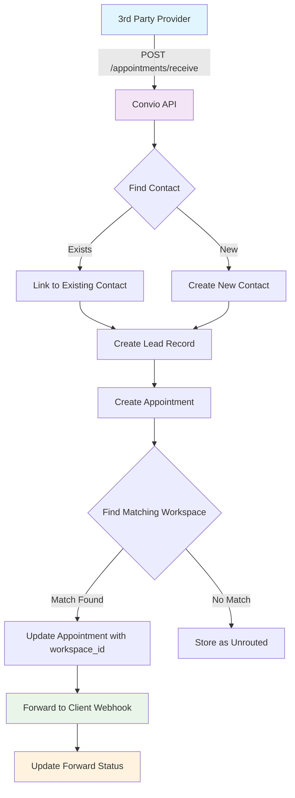

# Appointment Routing & Forwarding System

## Overview

The Appointment Routing System automatically receives appointments from 3rd party providers, matches them to appropriate client workspaces based on product type and zip code criteria, and forwards them to client webhook endpoints.

## System Architecture



## Data Flow Architecture

```
┌─────────────────┐    ┌──────────────────┐    ┌─────────────────┐
│   3rd Party     │    │   Convio API     │    │  Client System  │
│   Appointment   │───▶│                  │───▶│                 │
│   Provider      │    │  Routing Engine  │    │  Webhook URL    │
└─────────────────┘    └──────────────────┘    └─────────────────┘
         │                        │                       │
         │                        ▼                       │
         │              ┌──────────────────┐              │
         │              │   Database       │              │
         │              │                  │              │
         └──────────────│ • contacts       │              │
                        │ • leads          │              │
                        │ • appointments   │              │
                        │ • routing_rules  │              │
                        │ • workspaces     │◀─────────────┘
                        └──────────────────┘
```

## Routing Logic Flow

```
Input: Appointment Data
├── service_type: "Solar"
├── customer_zip: "90210"
└── workspace_id: (optional)

Routing Process:
┌─ Priority Check ────────────────────────────────────────┐
│ IF workspace_id provided:                               │
│   └── Route directly to specified workspace            │
└─────────────────────────────────────────────────────────┘
         │ (if no workspace_id)
         ▼
┌─ Rule Matching ────────────────────────────────────────┐
│ Query: SELECT * FROM appointment_routing_rules         │
│ WHERE product_types LIKE '%Solar%'                     │
│   AND zip_codes LIKE '%90210%'                         │
│   AND is_active = 1                                    │
│ ORDER BY priority ASC                                  │
└─────────────────────────────────────────────────────────┘
         │
         ▼
┌─ Result ───────────────────────────────────────────────┐
│ Match Found: workspace_id = "solar_team_ca"            │
│ Route Method: "auto"                                   │
└─────────────────────────────────────────────────────────┘
```

## Database Schema (Key Tables)

```sql
-- Appointments Table
CREATE TABLE appointments (
  id INTEGER PRIMARY KEY,
  customer_name TEXT,
  customer_phone TEXT,
  customer_email TEXT,
  service_type TEXT,
  customer_zip TEXT,
  estimated_value REAL,
  matched_workspace_id TEXT,
  routing_method TEXT,
  forwarded_at DATETIME,
  forward_status TEXT DEFAULT 'pending',
  forward_response TEXT,
  forward_attempts INTEGER DEFAULT 0
);

-- Routing Rules Table
CREATE TABLE appointment_routing_rules (
  id INTEGER PRIMARY KEY,
  workspace_id TEXT NOT NULL,
  product_types TEXT NOT NULL,  -- JSON array
  zip_codes TEXT NOT NULL,      -- JSON array
  priority INTEGER DEFAULT 1,
  is_active BOOLEAN DEFAULT 1
);

-- Workspaces Table
CREATE TABLE workspaces (
  id TEXT PRIMARY KEY,
  name TEXT NOT NULL,
  outbound_webhook_url TEXT,
  webhook_active BOOLEAN DEFAULT 0
);
```

## API Endpoints

### 1. Receive Appointment (3rd Party Integration)
```http
POST /appointments/receive
Content-Type: application/json
User-Agent: YourProvider/1.0
```

### 2. Manual Forward Appointment
```http
POST /appointments/{id}/forward
Content-Type: application/json
```

### 3. List Appointments
```http
GET /appointments
```

### 4. Manage Routing Rules
```http
GET /routing-rules
POST /routing-rules
PUT /routing-rules/{id}
DELETE /routing-rules/{id}
```

### 5. Bulk Upload Routing Rules
```http
POST /routing-rules/bulk
Content-Type: multipart/form-data
```

## Sample cURL Commands for Testing

### 1. Send Test Appointment (Solar in California)
```bash
curl -X POST https://api.homeprojectpartners.com/appointments/receive \
  -H "Content-Type: application/json" \
  -H "User-Agent: TestProvider/1.0" \
  -d '{
    "customer_name": "John Solar Customer",
    "customer_phone": "555-123-4567",
    "customer_email": "john@example.com",
    "service_type": "Solar",
    "customer_zip": "90210",
    "appointment_date": "2024-12-01T14:00:00Z",
    "estimated_value": 25000,
    "notes": "Interested in rooftop solar installation"
  }'
```

### 2. Send Test Appointment (HVAC in NYC)
```bash
curl -X POST https://api.homeprojectpartners.com/appointments/receive \
  -H "Content-Type: application/json" \
  -H "User-Agent: TestProvider/1.0" \
  -d '{
    "customer_name": "Jane HVAC Customer",
    "customer_phone": "555-987-6543",
    "customer_email": "jane@example.com",
    "service_type": "HVAC",
    "customer_zip": "10001",
    "appointment_date": "2024-12-02T15:00:00Z",
    "estimated_value": 15000,
    "notes": "Need new HVAC system installation"
  }'
```

### 3. Send Appointment with Priority Routing (workspace_id override)
```bash
curl -X POST https://api.homeprojectpartners.com/appointments/receive \
  -H "Content-Type: application/json" \
  -H "User-Agent: TestProvider/1.0" \
  -d '{
    "customer_name": "Priority Customer",
    "customer_phone": "555-555-5555",
    "customer_email": "priority@example.com",
    "service_type": "Bath",
    "customer_zip": "12345",
    "workspace_id": "demo_sales_team",
    "appointment_date": "2024-12-03T10:00:00Z",
    "estimated_value": 8000,
    "notes": "High priority customer - route to specific team"
  }'
```

### 4. Manually Forward Appointment
```bash
curl -X POST https://api.homeprojectpartners.com/appointments/12/forward \
  -H "Content-Type: application/json" \
  -d '{"workspace_id": "demo_sales_team"}'
```

### 5. Get All Appointments
```bash
curl -X GET https://api.homeprojectpartners.com/appointments \
  -H "Content-Type: application/json"
```

### 6. Create Routing Rule
```bash
curl -X POST https://api.homeprojectpartners.com/routing-rules \
  -H "Content-Type: application/json" \
  -d '{
    "workspace_id": "solar_team_west",
    "product_types": ["Solar", "Battery"],
    "zip_codes": ["90210", "90211", "90212"],
    "priority": 1,
    "notes": "West coast solar team"
  }'
```

### 7. Test Webhook Endpoint (from UI)
```bash
curl -X POST https://your-webhook-url.com/appointments \
  -H "Content-Type: application/json" \
  -H "User-Agent: Convio-Appointment-Router/1.0" \
  -H "X-Webhook-Source: appointment-routing" \
  -d '{
    "appointment_id": 999999,
    "customer_name": "Test Customer",
    "customer_phone": "555-000-0000",
    "customer_email": "test@example.com",
    "service_type": "Test Service",
    "customer_zip": "12345",
    "appointment_date": "2024-12-01T14:00:00Z",
    "estimated_value": 1000,
    "notes": "This is a test appointment from the routing system",
    "routing_method": "manual",
    "matched_at": "2024-01-15T10:30:00Z",
    "workspace_id": "demo_sales_team",
    "test_webhook": true
  }'
```

## Webhook Payload Format

When an appointment is successfully routed, the following JSON payload is sent to the client's webhook URL:

```json
{
  "appointment_id": 123,
  "customer_name": "John Doe",
  "customer_phone": "555-123-4567",
  "customer_email": "john@example.com",
  "service_type": "Solar",
  "customer_zip": "90210",
  "appointment_date": "2024-12-01T14:00:00Z",
  "estimated_value": 25000,
  "notes": "Customer interested in rooftop solar installation",
  "routing_method": "auto",
  "matched_at": "2024-01-15T10:30:00Z",
  "workspace_id": "solar_team_ca"
}
```

### Webhook Headers
- `Content-Type: application/json`
- `User-Agent: Convio-Appointment-Router/1.0`
- `X-Webhook-Source: appointment-routing`

## Postman Collection Setup

### Environment Variables
Create a Postman environment with:
- `api_base_url`: `https://api.homeprojectpartners.com`
- `test_webhook_url`: Your webhook endpoint for testing

### Test Scenarios

1. **Happy Path Test**: Send appointment → Verify routing → Check webhook delivery
2. **Priority Routing Test**: Include workspace_id → Verify direct routing
3. **No Match Test**: Use invalid zip/product → Verify unrouted status
4. **Manual Forward Test**: Create unrouted appointment → Manually forward

## Monitoring & Debugging

### Check Appointment Status
```bash
# Get specific appointment details
curl -X GET https://api.homeprojectpartners.com/appointments/123

# Check forwarding status in database
wrangler d1 execute convio-leads --remote --command "
  SELECT id, matched_workspace_id, forward_status, forwarded_at
  FROM appointments
  WHERE id = 123;
"
```

### View Routing Rules
```bash
curl -X GET https://api.homeprojectpartners.com/routing-rules
```

### Check Workspace Configuration
```bash
curl -X GET https://api.homeprojectpartners.com/conversions/workspaces
```

## Error Handling

| Status | Description | Action |
|--------|-------------|---------|
| `pending` | Awaiting webhook forwarding | Normal initial state |
| `success` | Successfully forwarded | Complete |
| `failed` | Forward attempt failed | Check webhook URL & retry |
| `unrouted` | No matching workspace found | Add routing rule or manual forward |

## Performance Notes

- Routing queries use indexes on `product_types` and `zip_codes` JSON fields
- Webhook forwarding is asynchronous and doesn't block appointment creation
- Failed forwards are retried with exponential backoff
- Maximum 3 retry attempts per appointment

## Security

- All webhook requests include signature validation headers
- CORS policies restrict API access to approved domains
- Rate limiting applies to appointment ingestion endpoints
- Webhook URLs are validated before configuration